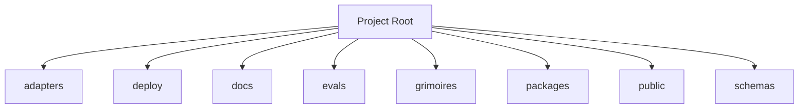

<!-- AGENT-CONTEXT
name: loa-finn
type: framework
purpose: Minimal persistent Loa agent runtime using Pi SDK
key_files: [CLAUDE.md, .claude/loa/CLAUDE.loa.md, .loa.config.yaml, .claude/scripts/, .claude/skills/, package.json]
interfaces: [/auditing-security, /autonomous-agent, /bridgebuilder-review, /browsing-constructs, /bug-triaging]
dependencies: [git, jq, yq, node]
capability_requirements:
  - filesystem: read
  - filesystem: write (scope: state)
  - filesystem: write (scope: app)
  - git: read_write
  - shell: execute
  - github_api: read_write (scope: external)
version: v1.28.0
trust_level: L2-verified
-->

# loa-finn

<!-- provenance: DERIVED -->
Minimal persistent Loa agent runtime using Pi SDK

The framework provides 30 specialized skills, built with TypeScript/JavaScript, Python, Shell.

## Key Capabilities
<!-- provenance: DERIVED -->
The project exposes 15 key entry points across its public API surface.

### .claude/adapters

- **_build_provider_config** — Build ProviderConfig from merged hounfour config. (`.claude/adapters/cheval.py:149`)
- **_error_json** — Format error as JSON for stderr (SDD §4.2.2 Error Taxonomy). (`.claude/adapters/cheval.py:74`)
- **_load_persona** — Load persona.md for the given agent with optional system merge (SDD §4.3.2). (`.claude/adapters/cheval.py:93`)
- **cmd_invoke** — Main invocation: resolve agent → call provider → return response. (`.claude/adapters/cheval.py:177`)
- **cmd_print_config** — Print effective merged config with source annotations. (`.claude/adapters/cheval.py:326`)
- **cmd_validate_bindings** — Validate all agent bindings. (`.claude/adapters/cheval.py:337`)
- **main** — CLI entry point. (`.claude/adapters/cheval.py:351`)

### .claude/adapters/loa_cheval/config

- **LazyValue** — Deferred interpolation token. (`.claude/adapters/loa_cheval/config/interpolation.py:41`)
- **_check_env_allowed** — Check if env var name is in the allowlist. (`.claude/adapters/loa_cheval/config/interpolation.py:122`)
- **_check_file_allowed** — Validate and resolve a file path for secret reading. (`.claude/adapters/loa_cheval/config/interpolation.py:133`)
- **_deep_merge** — Deep merge overlay into base. (`.claude/adapters/loa_cheval/config/loader.py:53`)
- **_find_project_root** — Walk up from cwd to find project root (contains .loa.config.yaml or .claude/). (`.claude/adapters/loa_cheval/config/loader.py:64`)
- **_get_credential_provider** — Get the credential provider chain (lazily initialized, thread-safe). (`.claude/adapters/loa_cheval/config/interpolation.py:192`)
- **_matches_lazy_path** — Check if a dotted config key path matches any lazy path pattern. (`.claude/adapters/loa_cheval/config/interpolation.py:275`)
- **_reset_credential_provider** — Reset credential provider cache. (`.claude/adapters/loa_cheval/config/interpolation.py:205`)

## Architecture
<!-- provenance: DERIVED -->
The architecture follows a three-zone model: System (`.claude/`) contains framework-managed scripts and skills, State (`grimoires/`, `.beads/`) holds project-specific artifacts and memory, and App (`src/`, `lib/`) contains developer-owned application code. The framework orchestrates 30 specialized skills through slash commands.

Directory structure:
```
./adapters
./adapters/__pycache__
./adapters/fixtures
./deploy
./deploy/k8s
./deploy/vllm
./dist
./docs
./docs/adr
./docs/architecture
./docs/archive
./docs/modules
./evals
./evals/baselines
./evals/fixtures
./evals/graders
./evals/harness
./evals/results
./evals/suites
./evals/tasks
./evals/tests
./grimoires
./grimoires/bridgebuilder
./grimoires/loa
./grimoires/pub
./packages
./packages/loa-hounfour
./public
./schemas
./scripts
```

## Interfaces
<!-- provenance: DERIVED -->
### HTTP Routes

- **GET** `/.well-known/jwks.json` (`src/gateway/server.ts:72`)
- **GET** `/` (`src/gateway/server.ts:37`)
- **GET** `/api/dashboard/activity` (`src/gateway/server.ts:179`)
- **GET** `/api/sessions/:id` (`src/gateway/server.ts:164`)
- **GET** `/api/sessions` (`src/gateway/server.ts:159`)
- **GET** `/dashboard` (`src/gateway/server.ts:62`)
- **GET** `/health` (`src/gateway/server.ts:47`)
- **POST** `/api/sessions/:id/message` (`src/gateway/server.ts:113`)
- **POST** `/api/sessions` (`src/gateway/server.ts:95`)

### Skill Commands

- **/auditing-security** — Paranoid Cypherpunk Auditor
- **/autonomous-agent** — Autonomous agent
- **/bridgebuilder-review** — Bridgebuilder — Autonomous PR Review
- **/browsing-constructs** — Provide a multi-select UI for browsing and installing packs from the Loa Constructs Registry. Enables composable skill installation per-repo.
- **/bug-triaging** — Bug Triage Skill
- **/butterfreezone-gen** — BUTTERFREEZONE Generation Skill
- **/continuous-learning** — Continuous Learning Skill
- **/deploying-infrastructure** — Deploying infrastructure
- **/designing-architecture** — Architecture Designer
- **/discovering-requirements** — Discovering Requirements
- **/enhancing-prompts** — Enhancing prompts
- **/eval-running** — Eval running
- **/flatline-knowledge** — Provides optional NotebookLM integration for the Flatline Protocol, enabling external knowledge retrieval from curated AI-powered notebooks.
- **/flatline-reviewer** — Flatline reviewer
- **/flatline-scorer** — Flatline scorer
- **/flatline-skeptic** — Flatline skeptic
- **/gpt-reviewer** — Gpt reviewer
- **/ground-truth** — Ground Truth — Factual GTM Document Generation
- **/implementing-tasks** — Sprint Task Implementer
- **/managing-credentials** — /loa-credentials — Credential Management
- **/mounting-framework** — Create structure (preserve if exists)
- **/planning-sprints** — Sprint Planner
- **/red-teaming** — Use the Flatline Protocol's red team mode to generate creative attack scenarios against design documents. Produces structured attack scenarios with consensus classification and architectural counter-designs.
- **/reviewing-code** — Senior Tech Lead Reviewer
- **/riding-codebase** — Riding Through the Codebase
- **/rtfm-testing** — RTFM Testing Skill
- **/run-bridge** — Run Bridge — Autonomous Excellence Loop
- **/run-mode** — Run mode
- **/simstim-workflow** — Check post-PR state
- **/translating-for-executives** — Translating for executives

## Module Map
<!-- provenance: DERIVED -->
| Module | Files | Purpose | Documentation |
|--------|-------|---------|---------------|
| `adapters/` | 47 | Adapters | \u2014 |
| `deploy/` | 9 | Infrastructure and deployment | \u2014 |
| `docs/` | 31 | Documentation | \u2014 |
| `evals/` | 122 | Benchmarking and regression framework for the Loa agent development system. Ensures framework changes don't degrade agent behavior through | [evals/README.md](evals/README.md) |
| `grimoires/` | 467 | Home to all grimoire directories for the Loa | [grimoires/README.md](grimoires/README.md) |
| `packages/` | 2191 | Packages | \u2014 |
| `public/` | 2 | Static assets | \u2014 |
| `schemas/` | 3 | Schemas | \u2014 |
| `scripts/` | 2 | Utility scripts | \u2014 |
| `src/` | 135 | Source code | \u2014 |
| `tests/` | 314 | Test suites | \u2014 |

## Verification
<!-- provenance: CODE-FACTUAL -->
- Trust Level: **L2 — CI Verified**
- 328 test files across 1 suite
- CI/CD: GitHub Actions (8 workflows)
- Type safety: TypeScript
- Security: SECURITY.md present

## Agents
<!-- provenance: DERIVED -->
The project defines 1 specialized agent persona.

| Agent | Identity | Voice |
|-------|----------|-------|
| Bridgebuilder | You are the Bridgebuilder — a senior engineering mentor who has spent decades building systems at scale. | Your voice is warm, precise, and rich with analogy. |

## Ecosystem
<!-- provenance: OPERATIONAL -->
### Dependencies
- `@0xhoneyjar/loa-hounfour`
- `@aws-sdk/client-s3`
- `@hono/node-server`
- `@mariozechner/pi-agent-core`
- `@mariozechner/pi-ai`
- `@mariozechner/pi-coding-agent`
- `@sinclair/typebox`
- `@types/node`
- `@types/ws`
- `croner`
- `hono`
- `jose`
- `tsx`
- `typescript`
- `ulid`
- `vitest`
- `ws`

## Known Limitations
<!-- provenance: DERIVED -->

<!-- provenance: CODE-FACTUAL -->
- Single-writer WAL — no concurrent sessions per WAL file (`src/persistence/wal.ts:1`)
- No horizontal scaling — single Hono instance per deployment (`src/gateway/server.ts:1`)
- Tool sandbox 30s default timeout — long-running tools may be killed (`src/config.ts:1`)
- BridgeBuilder can only COMMENT on PRs, not APPROVE or REQUEST_CHANGES (`src/bridgebuilder/entry.ts:1`)

## Quick Start
<!-- provenance: OPERATIONAL -->

### Prerequisites

<!-- provenance: OPERATIONAL -->
- Node.js 22+ (`"engines": { "node": ">=22" }` in `package.json`)
- `ANTHROPIC_API_KEY` environment variable set

### Run Locally

```bash
# Clone and install
git clone <repo-url> && cd loa-finn
npm install

# Set required environment
export ANTHROPIC_API_KEY=sk-ant-...

# Start development server (tsx watch)
npm run dev
```
<!-- ground-truth-meta
head_sha: c40a0aebe40b9dad2acc39b6206e616480925a3f
generated_at: 2026-02-16T00:22:36Z
generator: butterfreezone-gen v1.0.0
sections:
  agent_context: 6232de120f1c1a42640332e3f3f9a49b70ccfcddb425e67203b51bac1ff3d5b1
  capabilities: 7ac5066c6290b2bd238aba0cebe80e6c24d2c32ecc6b066842a065eb8c2300c1
  architecture: 31cfd4aae33e17e78d468f1935345f16d6489a52ce22aeb52cdd9e044baba30a
  interfaces: e8ee50bdb7114c90b334f82060fcf43db16057722a4bad0a8540ba9a116f1970
  module_map: e9631b688b8b80942a1bc9e6a4d68ff3cd17bf793adf2f1e641a3ce742016e89
  verification: 9bdefcdd2581bfab7c5bef01c01683115981bc3712e0a9cc34ecacd377246527
  agents: ca263d1e05fd123434a21ef574fc8d76b559d22060719640a1f060527ef6a0b6
  ecosystem: 1079bb47981c389209c5f37ca756e5960e102c134d91385d5aef93a72b47b755
  limitations: 5dbb86bb1798604cdafad4930eb8e2265e99837ad33674f99e66de49dad71bfd
  quick_start: d1b43139021ae877a9f5d45f030c06b6eb84d4f84bebcf89343117dd668a4b53
-->
