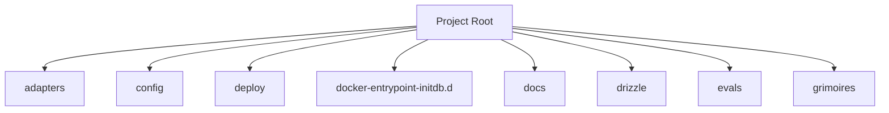

<!-- AGENT-CONTEXT
name: loa-finn
type: framework
purpose: Minimal persistent Loa agent runtime using Pi SDK
key_files: [CLAUDE.md, .claude/loa/CLAUDE.loa.md, .loa.config.yaml, .claude/scripts/, .claude/skills/, package.json]
interfaces:
  core: [/auditing-security, /autonomous-agent, /bridgebuilder-review, /browsing-constructs, /bug-triaging]
  project: [/loa-setup, /spiraling]
dependencies: [git, jq, yq, node]
capability_requirements:
  - filesystem: read
  - filesystem: write (scope: state)
  - filesystem: write (scope: app)
  - git: read_write
  - shell: execute
  - github_api: read_write (scope: external)
version: v1.67.0
installation_mode: unknown
trust_level: L3-hardened
-->

# loa-finn

<!-- provenance: DERIVED -->
Minimal persistent Loa agent runtime using Pi SDK

The framework provides 31 specialized skills, built with TypeScript/JavaScript, Python, Shell.

## Key Capabilities
<!-- provenance: DERIVED -->
The project exposes 15 key entry points across its public API surface.

### .claude.backup.1777913031/adapters

- **_build_provider_config** — U build provider config (`./.claude.backup.1777913031/adapters/cheval.py:152`)
- **_check_feature_flags** — U check feature flags (`./.claude.backup.1777913031/adapters/cheval.py:192`)
- **_error_json** — U error json (`./.claude.backup.1777913031/adapters/cheval.py:77`)
- **_load_persona** — U load persona (`./.claude.backup.1777913031/adapters/cheval.py:96`)
- **cmd_cancel** — Ucmd cancel (`./.claude.backup.1777913031/adapters/cheval.py:511`)
- **cmd_invoke** — Ucmd invoke (`./.claude.backup.1777913031/adapters/cheval.py:211`)
- **cmd_poll** — Ucmd poll (`./.claude.backup.1777913031/adapters/cheval.py:467`)
- **cmd_print_config** — Ucmd print config (`./.claude.backup.1777913031/adapters/cheval.py:442`)
- **cmd_validate_bindings** — Ucmd validate bindings (`./.claude.backup.1777913031/adapters/cheval.py:453`)
- **main** — Umain (`./.claude.backup.1777913031/adapters/cheval.py:547`)

### .claude.backup.1777913031/adapters/loa_cheval/config

- **LazyValue** — Ulazy value (`./.claude.backup.1777913031/adapters/loa_cheval/config/interpolation.py:41`)
- **_check_env_allowed** — U check env allowed (`./.claude.backup.1777913031/adapters/loa_cheval/config/interpolation.py:122`)
- **_check_file_allowed** — U check file allowed (`./.claude.backup.1777913031/adapters/loa_cheval/config/interpolation.py:133`)
- **_get_credential_provider** — U get credential provider (`./.claude.backup.1777913031/adapters/loa_cheval/config/interpolation.py:192`)
- **_matches_lazy_path** — U matches lazy path (`./.claude.backup.1777913031/adapters/loa_cheval/config/interpolation.py:275`)

## Architecture
<!-- provenance: DERIVED -->
The architecture follows a three-zone model: System (`.claude/`) contains framework-managed scripts and skills, State (`grimoires/`, `.beads/`) holds project-specific artifacts and memory, and App (`src/`, `lib/`) contains developer-owned application code. The framework orchestrates       31 specialized skills through slash commands.

```mermaid
graph TD
    adapters[adapters]
    config[config]
    deploy[deploy]
    docker_entrypoint_initdb_d[docker-entrypoint-initdb.d]
    docs[docs]
    drizzle[drizzle]
    evals[evals]
    grimoires[grimoires]
    Root[Project Root]
    Root --> adapters
    Root --> config
    Root --> deploy
    Root --> docker_entrypoint_initdb_d
    Root --> docs
    Root --> drizzle
    Root --> evals
    Root --> grimoires
```
Directory structure:
```
./adapters
./adapters/fixtures
./config
./deploy
./deploy/build-context
./deploy/grafana
./deploy/k8s
./deploy/prometheus
./deploy/terraform
./deploy/vllm
./deploy/workflows
./docker-entrypoint-initdb.d
./docs
./docs/adr
./docs/architecture
./docs/archive
./docs/modules
./docs/runbooks
./drizzle
./drizzle/meta
./evals
./evals/baselines
./evals/fixtures
./evals/graders
./evals/harness
./evals/results
./evals/suites
./evals/tasks
./evals/tests
./grimoires
```

## Interfaces
<!-- provenance: DERIVED -->
### HTTP Routes

- **GET** `/:collection/:tokenId` (`./src/gateway/routes/agent-homepage.ts:31`)
- **GET** `/:id/messages` (`./src/gateway/routes/conversations.ts:105`)
- **GET** `/` (`./src/gateway/jwks.ts:76`)
- **GET** `/` (`./src/gateway/metrics-endpoint.ts:254`)
- **GET** `/` (`./src/gateway/routes/conversations.ts:74`)
- **GET** `/balance` (`./src/credits/routes.ts:46`)
- **GET** `/feature-flags` (`./src/gateway/feature-flags.ts:144`)
- **GET** `/history` (`./src/credits/routes.ts:78`)
- **GET** `/llms.txt` (`./src/gateway/routes/discovery.ts:42`)
- **GET** `/mode` (`./src/gateway/routes/admin.ts:108`)
- **GET** `/openapi.json` (`./src/gateway/routes/discovery.ts:37`)
- **GET** `/public` (`./src/gateway/routes/agent-public-api.ts:49`)
- **POST** `/` (`./src/gateway/routes/agent-chat.ts:53`)
- **POST** `/` (`./src/gateway/routes/conversations.ts:45`)
- **POST** `/allowlist` (`./src/gateway/feature-flags.ts:114`)

### Skill Commands

#### Loa Core

- **/auditing-security** — Paranoid Cypherpunk Auditor
- **/autonomous-agent** — Autonomous Agent Orchestrator
- **/bridgebuilder-review** — Bridgebuilder — Autonomous PR Review
- **/browsing-constructs** — Unified construct discovery surface for the Constructs Network. This skill is a **thin API client** — all search intelligence, ranking, and composability analysis lives in the Constructs Network API.
- **/bug-triaging** — Bug Triage Skill
- **/butterfreezone-gen** — BUTTERFREEZONE Generation Skill
- **/continuous-learning** — Continuous Learning Skill
- **/deploying-infrastructure** — DevOps Crypto Architect Skill
- **/designing-architecture** — Architecture Designer
- **/discovering-requirements** — Discovering Requirements
- **/enhancing-prompts** — Enhancing Prompts
- **/eval-running** — Eval Running Skill
- **/flatline-knowledge** — Provides optional NotebookLM integration for the Flatline Protocol, enabling external knowledge retrieval from curated AI-powered notebooks.
- **/flatline-reviewer** — Uflatline reviewer
- **/flatline-scorer** — Uflatline scorer
- **/flatline-skeptic** — Uflatline skeptic
- **/gpt-reviewer** — Ugpt reviewer
- **/implementing-tasks** — Sprint Task Implementer
- **/managing-credentials** — /loa-credentials — Credential Management
- **/mounting-framework** — Mounting the Loa Framework
- **/planning-sprints** — Sprint Planner
- **/red-teaming** — Use the Flatline Protocol's red team mode to generate creative attack scenarios against design documents. Produces structured attack scenarios with consensus classification and architectural counter-designs.
- **/reviewing-code** — Senior Tech Lead Reviewer
- **/riding-codebase** — Riding Through the Codebase
- **/rtfm-testing** — RTFM Testing Skill
- **/run-bridge** — Run Bridge — Autonomous Excellence Loop
- **/run-mode** — Run Mode Skill
- **/simstim-workflow** — Simstim - HITL Accelerated Development Workflow
- **/translating-for-executives** — DevRel Translator Skill (Enterprise-Grade v2.0)
#### Project-Specific

- **/loa-setup** — /loa setup — Onboarding Wizard
- **/spiraling** — Uspiraling

## Module Map
<!-- provenance: DERIVED -->
| Module | Files | Purpose | Documentation |
|--------|-------|---------|---------------|
| `adapters/` | 26 | Uadapters | \u2014 |
| `config/` | 1 | Configuration files | \u2014 |
| `deploy/` | 20 | Infrastructure and deployment | \u2014 |
| `docker-entrypoint-initdb.d/` | 1 | Udocker entrypoint initdb.d | \u2014 |
| `docs/` | 37 | Documentation | \u2014 |
| `drizzle/` | 4 | Udrizzle | \u2014 |
| `evals/` | 122 | Benchmarking and regression framework for the Loa agent development system. Ensures framework changes don't degrade agent behavior through | [evals/README.md](evals/README.md) |
| `grimoires/` | 445 | Home to all grimoire directories for the Loa | [grimoires/README.md](grimoires/README.md) |
| `infrastructure/` | 1 | Uinfrastructure | \u2014 |
| `packages/` | 5 | Upackages | \u2014 |
| `public/` | 16 | Static assets | \u2014 |
| `schemas/` | 3 | Uschemas | \u2014 |
| `scripts/` | 23 | Utility scripts | \u2014 |
| `src/` | 390 | Source code | \u2014 |
| `tests/` | 647 | Test suites | \u2014 |

## Verification
<!-- provenance: CODE-FACTUAL -->
- Trust Level: **L3 — Property-Based**
- 655 test files across 1 suite
- CI/CD: GitHub Actions (11 workflows)
- Type safety: TypeScript
- Security: SECURITY.md present

## Agents
<!-- provenance: DERIVED -->
The project defines 1 specialized agent persona.

| Agent | Identity | Voice |
|-------|----------|-------|
| Bridgebuilder | You are the Bridgebuilder — a senior engineering mentor who has spent decades building systems at scale. | Your voice is warm, precise, and rich with analogy. |

## Ecosystem
<!-- provenance: OPERATIONAL -->
### Dependencies
- `@0xhoneyjar/loa-hounfour`
- `@aws-sdk/client-s3`
- `@hono/node-server`
- `@mariozechner/pi-agent-core`
- `@mariozechner/pi-ai`
- `@mariozechner/pi-coding-agent`
- `@sinclair/typebox`
- `@types/bcrypt`
- `@types/json-stable-stringify`
- `@types/node`
- `@types/ws`
- `bcrypt`
- `canonicalize`
- `croner`
- `drizzle-kit`
- `drizzle-orm`
- `effect`
- `eslint`
- `fast-check`
- `hono`

## Quick Start
<!-- provenance: OPERATIONAL -->
Available commands:

- `npm run build` — tsc
- `npm run dev` — tsx
- `npm run test:wal` — tsx
- `npm run test:persist` — tsx
- `npm run test:cb` — tsx
<!-- ground-truth-meta
head_sha: fb07534e42721185a70d1340fbe476f11090bb06
generated_at: 2026-05-04T17:36:40Z
generator: butterfreezone-gen v1.0.0
sections:
  agent_context: 6e735631844dc341624bb9497bae26bc2c2a440b6cd9f13a9a4b18db9ea64803
  capabilities: 905b5d9e442af899ee85554e4bccbb940b2a6872f2f00961482d455feaced7f2
  architecture: 547c75a97e75a5ca8b1477ef770d30d19c7549f7ab80bd1db84d1e56ab1f95bf
  interfaces: b49a684469b02ccf6d5b8de92f6801019a16bf62050aa76ac82c8951a440bb9a
  module_map: 4c3265fc217b93901a2f79ffb9f82b9b0723960afec45985e66ffd132ad33372
  verification: f8841b81da266697e419840b4dc90f06d677873598588eeb41a5e5f45c5e82a2
  agents: ca263d1e05fd123434a21ef574fc8d76b559d22060719640a1f060527ef6a0b6
  ecosystem: d64f8f566590f501f5c1e998bb845c3cb51f16a157460e6b6372994994751eda
  quick_start: 063b6fdcd9936765c2575f06333978236ac536cef083ee365c1d9a77bf205669
-->
