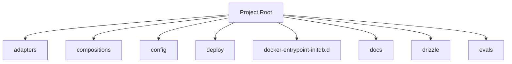

<!-- AGENT-CONTEXT
name: loa-finn
type: framework
purpose: Minimal persistent Loa agent runtime using Pi SDK
key_files: [CLAUDE.md, .claude/loa/CLAUDE.loa.md, .loa.config.yaml, .claude/scripts/, .claude/skills/, package.json]
interfaces:
  core: [/auditing-security, /autonomous-agent, /bridgebuilder-review, /browsing-constructs, /bug-triaging]
  project: [/loa-setup, /spiraling]
dependencies: [git, jq, yq, node]
capability_requirements:
  - filesystem: read
  - filesystem: write (scope: state)
  - filesystem: write (scope: app)
  - git: read_write
  - shell: execute
  - github_api: read_write (scope: external)
version: v1.67.0
installation_mode: unknown
trust_level: L3-hardened
-->

# loa-finn

<!-- provenance: CODE-FACTUAL -->
Minimal persistent Loa agent runtime using Pi SDK

The framework provides 31 specialized skills, built with TypeScript/JavaScript, Python, Shell.

## Key Capabilities
<!-- provenance: CODE-FACTUAL -->

# API Surface
## Health / Ops
- `GET /` · `GET /health` · `GET /healthz` · `GET /health/deps` — liveness/readiness + deps
- `GET /metrics` — Prometheus
- `GET /.well-known/jwks.json` — JWKS publication
- `GET /dashboard` · `GET /api/dashboard/activity` — operator dashboard
## Sessions
- `POST /api/sessions` — create session
- `POST /api/sessions/:id/message` — send message
- `GET /api/sessions` · `GET /api/sessions/:id` — list / fetch
## Model Invocation & Billing
- `POST /api/v1/invoke` — model invoke (economic-boundary + billing middleware, `server.ts:299-331`)
- `GET /api/v1/usage` — usage ledger (`server.ts:336`)
## Sub-apps (`app.route()`)
- `/api/v1/oracle` — knowledge oracle (CORS+auth+rateLimit+concurrency+corpusVersion middleware)
- `/api/v1/x402`, `/api/v1/pay` — x402 payments
- `/api/v1/agent/chat` — NFT agent chat (ownership-gated)
- `/api/v1` (public), `/api/v1/conversations` — public agent + conversations
- `/agent` — NFT agent homepage
- `/api/identity` — identity resolution

## Architecture
<!-- provenance: CODE-FACTUAL -->
The architecture follows a three-zone model: System (`.claude/`) contains framework-managed scripts and skills, State (`grimoires/`, `.beads/`) holds project-specific artifacts and memory, and App (`src/`, `lib/`) contains developer-owned application code. The framework orchestrates       31 specialized skills through slash commands.

```mermaid
graph TD
    adapters[adapters]
    compositions[compositions]
    config[config]
    deploy[deploy]
    docker_entrypoint_initdb_d[docker-entrypoint-initdb.d]
    docs[docs]
    drizzle[drizzle]
    evals[evals]
    Root[Project Root]
    Root --> adapters
    Root --> compositions
    Root --> config
    Root --> deploy
    Root --> docker_entrypoint_initdb_d
    Root --> docs
    Root --> drizzle
    Root --> evals
```
Directory structure:
```
./adapters
./adapters/fixtures
./compositions
./config
./deploy
./deploy/build-context
./deploy/grafana
./deploy/k8s
./deploy/prometheus
./deploy/score-stub
./deploy/terraform
./deploy/vllm
./deploy/workflows
./docker-entrypoint-initdb.d
./docs
./docs/adr
./docs/architecture
./docs/archive
./docs/modules
./docs/runbooks
./drizzle
./drizzle/meta
./evals
./evals/baselines
./evals/fixtures
./evals/graders
./evals/harness
./evals/results
./evals/suites
./evals/tasks
```

## Interfaces
<!-- provenance: CODE-FACTUAL -->
### HTTP Routes

- **GET** `/:collection/:tokenId` (`./src/gateway/routes/agent-homepage.ts:31`)
- **GET** `/` (`./src/gateway/jwks.ts:76`)
- **GET** `/` (`./src/gateway/metrics-endpoint.ts:254`)
- **GET** `/balance` (`./src/credits/routes.ts:46`)
- **GET** `/boom` (`./src/cost/cost-atom.test.ts:232`)
- **GET** `/feature-flags` (`./src/gateway/feature-flags.ts:144`)
- **GET** `/health` (`./deploy/score-stub/server.ts:25`)
- **GET** `/history` (`./src/credits/routes.ts:78`)
- **GET** `/mode` (`./src/gateway/routes/admin.ts:108`)
- **GET** `/ok` (`./src/cost/cost-atom.test.ts:225`)
- **GET** `/ok` (`./src/cost/cost-atom.test.ts:277`)
- **GET** `/ok` (`./src/cost/cost-atom.test.ts:296`)
- **GET** `/verdict/:agentId` (`./deploy/score-stub/server.ts:27`)
- **POST** `/` (`./src/gateway/routes/agent-chat.ts:53`)
- **POST** `/allowlist` (`./src/gateway/feature-flags.ts:114`)

### Skill Commands

#### Loa Core

- **/auditing-security** — Paranoid Cypherpunk Auditor
- **/autonomous-agent** — Autonomous Agent Orchestrator
- **/bridgebuilder-review** — Bridgebuilder — Autonomous PR Review
- **/browsing-constructs** — Unified construct discovery surface for the Constructs Network. This skill is a **thin API client** — all search intelligence, ranking, and composability analysis lives in the Constructs Network API.
- **/bug-triaging** — Bug Triage Skill
- **/butterfreezone-gen** — BUTTERFREEZONE Generation Skill
- **/continuous-learning** — Continuous Learning Skill
- **/deploying-infrastructure** — DevOps Crypto Architect Skill
- **/designing-architecture** — Architecture Designer
- **/discovering-requirements** — Discovering Requirements
- **/enhancing-prompts** — Enhancing Prompts
- **/eval-running** — Eval Running Skill
- **/flatline-knowledge** — Provides optional NotebookLM integration for the Flatline Protocol, enabling external knowledge retrieval from curated AI-powered notebooks.
- **/flatline-reviewer** — Uflatline reviewer
- **/flatline-scorer** — Uflatline scorer
- **/flatline-skeptic** — Uflatline skeptic
- **/gpt-reviewer** — Ugpt reviewer
- **/implementing-tasks** — Sprint Task Implementer
- **/managing-credentials** — /loa-credentials — Credential Management
- **/mounting-framework** — Mounting the Loa Framework
- **/planning-sprints** — Sprint Planner
- **/red-teaming** — Use the Flatline Protocol's red team mode to generate creative attack scenarios against design documents. Produces structured attack scenarios with consensus classification and architectural counter-designs.
- **/reviewing-code** — Senior Tech Lead Reviewer
- **/riding-codebase** — Riding Through the Codebase
- **/rtfm-testing** — RTFM Testing Skill
- **/run-bridge** — Run Bridge — Autonomous Excellence Loop
- **/run-mode** — Run Mode Skill
- **/simstim-workflow** — Simstim - HITL Accelerated Development Workflow
- **/translating-for-executives** — DevRel Translator Skill (Enterprise-Grade v2.0)
#### Project-Specific

- **/loa-setup** — /loa setup — Onboarding Wizard
- **/spiraling** — Uspiraling

## Module Map
<!-- provenance: CODE-FACTUAL -->
| Module | Files | Purpose | Documentation |
|--------|-------|---------|---------------|
| `adapters/` | 26 | Uadapters | \u2014 |
| `compositions/` | 2 | Ucompositions | \u2014 |
| `config/` | 1 | Configuration files | \u2014 |
| `deploy/` | 27 | Infrastructure and deployment | \u2014 |
| `docker-entrypoint-initdb.d/` | 1 | Udocker entrypoint initdb.d | \u2014 |
| `docs/` | 37 | Documentation | \u2014 |
| `drizzle/` | 5 | Udrizzle | \u2014 |
| `evals/` | 122 | Benchmarking and regression framework for the Loa agent development system. Ensures framework changes don't degrade agent behavior through | [evals/README.md](evals/README.md) |
| `grimoires/` | 548 | Home to all grimoire directories for the Loa | [grimoires/README.md](grimoires/README.md) |
| `infrastructure/` | 1 | Uinfrastructure | \u2014 |
| `observatory/` | 1976 | Uobservatory | \u2014 |
| `packages/` | 5 | Upackages | \u2014 |
| `public/` | 16 | Static assets | \u2014 |
| `schemas/` | 3 | Uschemas | \u2014 |
| `scripts/` | 36 | Utility scripts | \u2014 |
| `src/` | 404 | Source code | \u2014 |
| `tests/` | 647 | Test suites | \u2014 |
| `tmp/` | 18 | Utmp | \u2014 |

## Verification
<!-- provenance: CODE-FACTUAL -->
- Trust Level: **L3 — Property-Based**
- 658 test files across 1 suite
- CI/CD: GitHub Actions (11 workflows)
- Type safety: TypeScript
- Security: SECURITY.md present

## Agents
<!-- provenance: DERIVED -->
The project defines 1 specialized agent persona.

| Agent | Identity | Voice |
|-------|----------|-------|
| Bridgebuilder | You are the Bridgebuilder — a senior engineering mentor who has spent decades building systems at scale. | Your voice is warm, precise, and rich with analogy. |

## Ecosystem
<!-- provenance: OPERATIONAL -->
### Dependencies
- `@0xhoneyjar/loa-hounfour`
- `@aws-sdk/client-s3`
- `@hono/node-server`
- `@mariozechner/pi-agent-core`
- `@mariozechner/pi-ai`
- `@mariozechner/pi-coding-agent`
- `@sinclair/typebox`
- `@types/bcrypt`
- `@types/json-stable-stringify`
- `@types/node`
- `@types/ws`
- `bcrypt`
- `canonicalize`
- `croner`
- `drizzle-kit`
- `drizzle-orm`
- `effect`
- `eslint`
- `fast-check`
- `hono`

## Quick Start
<!-- provenance: OPERATIONAL -->
Available commands:

- `npm run build` — tsc
- `npm run dev` — tsx
- `npm run test:wal` — tsx
- `npm run test:persist` — tsx
- `npm run test:cb` — tsx

<!-- manual-start:experiment-program -->
## Experiment Program (the layer the gen doesn't see)

<!-- provenance: REPO-DOC-GROUNDED (grimoires/loa/, observatory/, /ride reality 2026-06-13) -->
loa-finn is also the **home of a research program** that the gen's API-surface view misses. It runs
pre-registered, sha-pinned experiments (bars set before data exists → instrumented run → readout that
survives its own falsifications) and records them on a **research spine** (`observatory/`, the
autoresearch-staircase: register/probe/settle).

- **EXP-001 cost-of-play** (settled): H1 FALSIFIED (inference = 93.7% of per-call cost, NOT
  infra-dominated) · H2 FALSIFIED (no amortization) · H3 HELD. The method works. Cost meter:
  `src/cost/cost-atom.ts` (3-ledger, hash-chained, integer-micro, closes-before-response).
- **EXP-002 agent-commerce forensics** (settled, score-api): the on-chain Virtuals agent economy is
  registration theater — 39,999 registered → ~460 operational → ~0 transacting; a6c9 = PRIZE_DISTRIBUTOR
  ($320.9M out of "commerce"). "Subsidy was the demand."
- **EXP-003 verify-the-void** (settled): **GO-vertical / NO-GO-horizontal.** Verification demand is real
  but vertical + in-house; deterministic verification sidesteps the LLM-non-determinism wall that sinks
  agent-to-agent reputation quorums (the moat). Buyer anchor: institutions pay ~$270k/yr for the *data
  asset* (not a formula).
- **EXP-004 = the graduation gate** (next, pre-registered as Sprint 2+3 in `grimoires/loa/sprint-finn-score.md`):
  a **real sybil layer** (replacing the `NotImplementedError` edges in `src/score/edge/`) + a **labeled
  ground-truth validation harness** (precision/recall — `precisionBar` is a placeholder today).

**The standing lesson (score-api #269 rescope):** a **deterministic formula is NOT the product** — the
validated substrate must exist first. `src/score` Sprint-1 core is pure + unit-tested but runs on
fixtures only (edges throw `NotImplementedError`); no precision/recall harness exists yet. Do not let a
score claim "forensic/court-admissible" until the graduation gate clears. Epistemology:
`grimoires/loa/context/epistemology-deterministic-layers.md` (claims enter `claimed`; only deterministic
instruments vs sha-pinned bars `settle`; abstain over fabricate).

> Cost-safe on-chain data routes through `@freeside/dune-meter` (loa-freeside) — never raw Dune.
<!-- manual-end:experiment-program -->

<!-- ground-truth-meta
head_sha: 0dbebb002483c73c261ef91ed8c2769644360c1b
generated_at: 2026-06-13T01:00:02Z
generator: butterfreezone-gen v1.0.0
sections:
  agent_context: 6e735631844dc341624bb9497bae26bc2c2a440b6cd9f13a9a4b18db9ea64803
  capabilities: 08a161a6712c3c6585cba69ccfc18111d790cf0d30601fe8be7808a727375bbd
  architecture: 79c2f542f2553e68c351d9e8c535b1a9e94f0ca2f2c74e23a31e9abab9148773
  interfaces: 2c331aaa1b512782a6e8460642f6320b26f45aa93b44814ec3408147aabb2f8d
  module_map: 28a176985bb144af7917d9972f72075371796fe4ed23d4540ffb60e35b31e37f
  verification: a8212a21503a6fe5f4fceb5e771c0487513ddde5001cb5c0be339e6bea034022
  agents: ca263d1e05fd123434a21ef574fc8d76b559d22060719640a1f060527ef6a0b6
  ecosystem: d64f8f566590f501f5c1e998bb845c3cb51f16a157460e6b6372994994751eda
  quick_start: 063b6fdcd9936765c2575f06333978236ac536cef083ee365c1d9a77bf205669
-->
