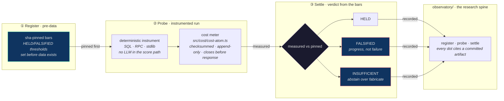

# loa-finn

<!-- AGENT-CONTEXT: loa-finn is a research engine — it answers "what's real?" by running
pre-registered, sha-pinned experiments (deploy instruments, settle deterministically, never an
LLM's guess). The first application is the agentic economy (real commerce vs theater), NOT the
definition — the method generalizes to anything you can pre-register and measure. Named for the
Finn (Gibson's Sprawl appraiser who could tell real from counterfeit), given a method.
and the runtime that rides them. Two halves: (1) the experiment program — EXP-001 cost-of-play,
EXP-002 agent-commerce forensics, EXP-003 verify-the-void, EXP-004 graduation gate — recorded on a
research spine (observatory/), with a checksummed append-only cost meter (src/cost/cost-atom.ts) and a
deterministic, no-LLM Score core (src/score/); (2) the agent runtime it rides on — multi-model
routing (src/hounfour/), durable WAL persistence (src/persistence/), cron + sandbox + audit trail.
Epistemology: claims enter `claimed`; only deterministic instruments vs sha-pinned bars `settle`;
abstain over fabricate (grimoires/loa/context/epistemology-deterministic-layers.md). License: AGPL-3.0. -->

[](LICENSE.md)
[](package.json)
[](https://github.com/0xHoneyJar/loa)

> **What a thing is worth, and whether it's real** — the Finn's whole job in Gibson's Sprawl, and this program's.

## What is this?

**loa-finn is a research engine — and the runtime that rides it.**

It answers one question — **what's real?** — by experiment instead of opinion: pre-register the bars *before* the data exists, run the instruments, settle with a readout that has to survive its own falsifications. The answers accrete on a public **research spine** ([`observatory/`](observatory/)), where every dot traces to a committed artifact. The first thing it was pointed at is the **agentic economy** (real commerce vs registration theater) — but the question, and the method, generalize to anything you can pre-register and measure. The agent economy is application #1, not the definition.

Underneath sits the runtime that makes the experiments cheap and durable: multi-model routing, a write-ahead log, a cron system, a tool sandbox, and a checksummed cost meter that closes the bill before the response returns. The program is the soul; the runtime is the body it rides.

## Why "Finn"?

In Gibson's *Neuromancer*, **the Finn** is a Sprawl fence — a dealer in hardware and information who can tell you what a thing is worth and whether it's real. When the AI **Wintermute** needs a face to speak to Case, it wears the Finn's: an intelligence putting on the appraiser to tell the real from the counterfeit. That's the patron — not a scientist (the Finn never was), but something better-fit: the one who could tell real from counterfeit and *prove the price*. This repo gives that instinct a method. The appraiser's question — *what's real, and what's it worth* — answered by experiment instead of opinion.

The lab is **[loa-laplas](https://github.com/0xHoneyJar/loa-laplas)** — the deterministic enforcement lattice where Finn deploys other constructs into isolated, traced, lawful rooms (named for Laplace's demon: given full state, every outcome reproduces; runs are *proven*, not asserted). Finn is the principal investigator; loa-laplas is the bench. (Loa: AI entities that *ride* you through the interface — same Sprawl.)

## The experiment program

Every experiment follows the same discipline: **register** the bars (pinned before data), **probe** (instrumented run), **settle** (a verdict from a deterministic instrument — `HELD` / `FALSIFIED` / `INSUFFICIENT` — never from an LLM). A falsification is progress.



| # | Experiment | Question | Settled |
|---|---|---|---|
| **EXP-001** | cost-of-play | Where does a per-call dollar go — infra or inference? | **H1/H2 FALSIFIED** (inference is 93.7% of per-call cost, *not* infra; no amortization) · H3 HELD |
| **EXP-002** | agent-commerce forensics | Is the on-chain agent economy real commerce? | **Registration theater** — 39,999 registered → ~0 transacting; $320.9M of "commerce" was prize distribution |
| **EXP-003** | verify-the-void | Is the verification market a place to build? | **GO-vertical / NO-GO-horizontal** — demand is real but vertical + in-house; deterministic verification is the moat |
| **EXP-004** | graduation gate | *(next)* Can the forensic score prove itself? | Pre-registered: a real sybil layer + a precision/recall validation harness — the substrate the product needs *first* |

The spine renders this at [`observatory/`](observatory/) (`npm --prefix observatory run dev`). The method came out of EXP-001 and held across all four — see [`grimoires/loa/context/epistemology-deterministic-layers.md`](grimoires/loa/context/epistemology-deterministic-layers.md).

**The standing lesson** (earned the hard way, score-api #269): *a deterministic formula is not the product.* The validated substrate — a real sybil layer, labeled ground-truth, measured precision/recall — must exist before any "forensic" claim. EXP-004 is that gate. And *a converged review pass is not verification*: independent cross-model review still caught real defects in code that had already "passed." Both lessons are load-bearing here.

## The substrate it rides on

The runtime is real and grounded — it's what makes the experiments cheap (`~$0` marginal at the cheapest tier) and reproducible.

- **Cost meter** — per-request 3-ledger record (inference / infra / orchestration), **checksummed** (sha256 per line), append-only, single-writer, integer micro-USD, **closes before the response returns** and is immutable once written ([`src/cost/cost-atom.ts`](src/cost/cost-atom.ts)). This is the instrument EXP-001 read. *(Tamper-evident against corruption per line; not yet inter-line hash-chained — deletion/reorder detection is a tracked follow-up. The `src/safety/` audit trail below **is** hash-chained.)*
- **Score core** — deterministic, **no-LLM** forensic scoring (`src/score/`). Sprint-1 (leaderboard / features / cluster / screen) is pure and unit-tested; the on-chain edge adapters are `NotImplementedError` by design (fixtures-only until EXP-004 builds the validated substrate).
- **Multi-model routing** — alias resolution, capability matching, budget enforcement, fallback chains ([`src/hounfour/router.ts`](src/hounfour/router.ts)).
- **Write-ahead log** — append-only WAL with R2 checkpoint + Git archive for crash recovery ([`src/persistence/wal.ts`](src/persistence/wal.ts)).
- **Cron + sandbox + audit** — circuit-breakered jobs ([`src/cron/service.ts`](src/cron/service.ts)), worker-thread tool isolation with a filesystem jail ([`src/agent/sandbox.ts`](src/agent/sandbox.ts)), and a SHA-256 hash-chained audit trail ([`src/safety/audit-trail.ts`](src/safety/audit-trail.ts)).
- **Cost-safe on-chain data** routes through [`@freeside/dune-meter`](https://github.com/0xHoneyJar/loa-freeside) — cost-capped, metered, never raw Dune (the EXP-002 budget scar, made structurally impossible).

## Quick Start

**Prerequisites:** Node.js 22+, `ANTHROPIC_API_KEY`.

```bash
git clone https://github.com/0xHoneyJar/loa-finn && cd loa-finn
npm install
export ANTHROPIC_API_KEY=sk-ant-...

npm run dev                       # runtime — http://localhost:3000, health at GET /health
npm --prefix observatory run dev  # the research spine
docker compose up                 # or run containerized
```

## Module Map

| Module | Purpose |
|--------|---------|
| **cost** | The checksummed append-only per-request cost meter — the experiment instrument |
| **score** | Deterministic no-LLM forensic scoring (Sprint-1 core; substrate is EXP-004) |
| **hounfour** | Multi-model routing, budget, JWT, orchestration |
| **gateway** | HTTP API, WebSocket, auth, rate limiting |
| **persistence** | WAL, R2 sync, Git sync, crash recovery |
| **cron** / **scheduler** | Scheduled jobs with circuit breakers + health |
| **agent** | Session management, sandbox, worker pool |
| **safety** | Audit trail, firewall, secret redaction |
| **substrate** | Effect-loader runtime + EventStore bridge |
| **bridgebuilder** | GitHub PR review automation |

## Documentation

| Topic | Where |
|---|---|
| Experiment program + epistemology | [`grimoires/loa/context/`](grimoires/loa/context/) (epistemology, experiment-economics, the EXP pre-registrations) |
| Research spine | [`observatory/`](observatory/) |
| Architecture · Operations · API | [docs/architecture.md](docs/architecture.md) · [docs/operations.md](docs/operations.md) · [docs/api-reference.md](docs/api-reference.md) |
| Security · Contributing · Changelog | [SECURITY.md](SECURITY.md) · [CONTRIBUTING.md](CONTRIBUTING.md) · [CHANGELOG.md](CHANGELOG.md) |

## Known limitations (honest)

- **Score edges are unbuilt** — `src/score/edge/` throws `NotImplementedError`; the core runs on fixtures, and no precision/recall harness exists *yet* (that's EXP-004). No "forensic/court-admissible" claim is earned until both EXP-004 kill gates fire.
- **Single-writer WAL** — no concurrent sessions per WAL file ([`src/persistence/wal.ts`](src/persistence/wal.ts)).
- **No horizontal scaling** — single Hono instance per deployment.
- **BridgeBuilder COMMENTs only** — it cannot APPROVE or REQUEST_CHANGES.

## Status & License

Active. The experiment program is at **EXP-004 (graduation gate)**; the runtime is in production-shaped use. Maintainer: [@janitooor](https://github.com/janitooor).

[AGPL-3.0](LICENSE.md) — use, modify, distribute freely; network deployments must release source. Commercial licenses available.

---

*Ridden with [Loa](https://github.com/0xHoneyJar/loa). Appraised by the Finn.*
