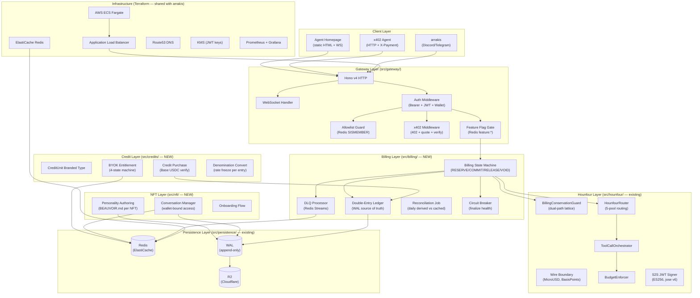
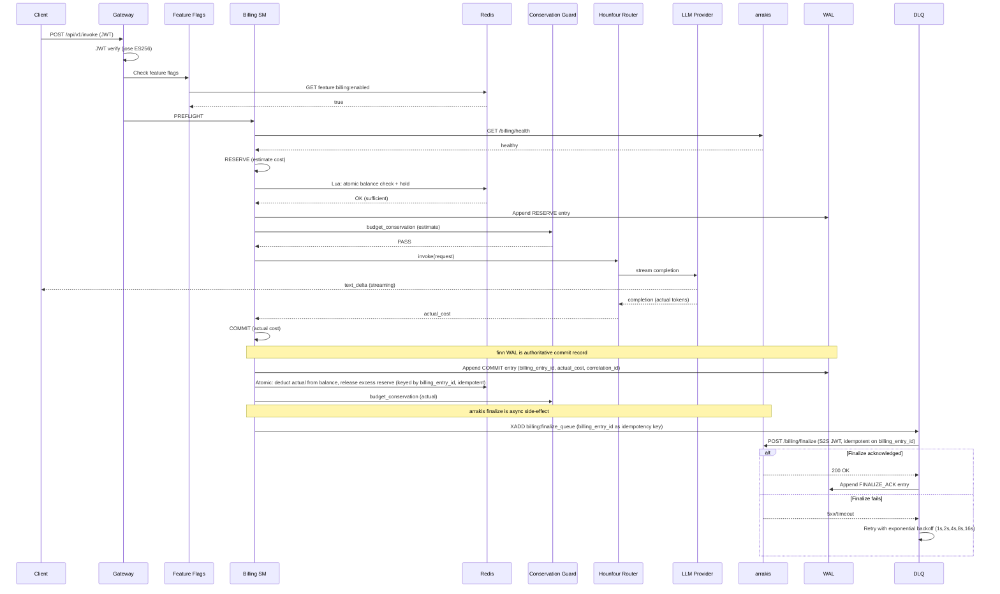
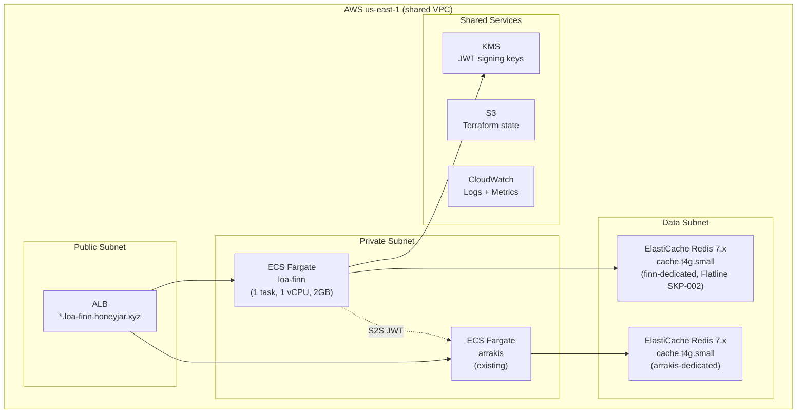
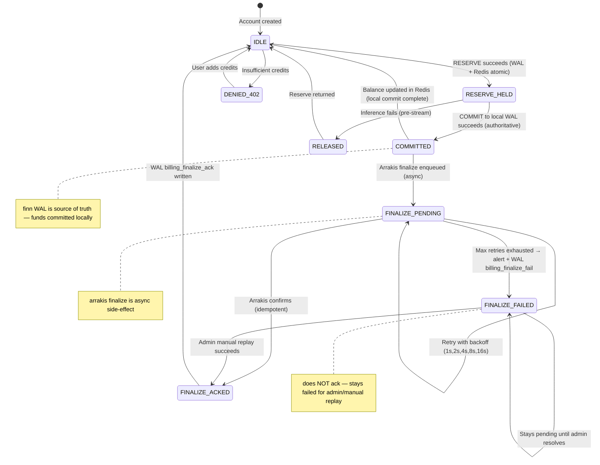
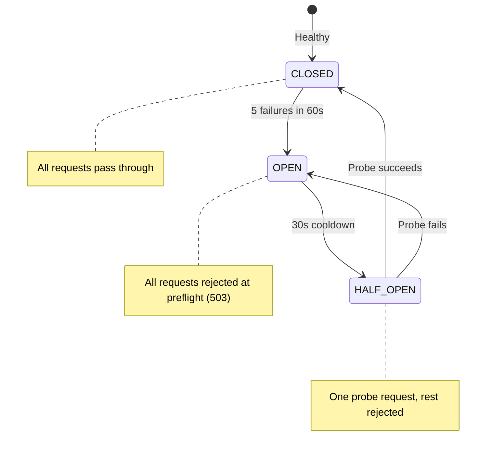

# SDD: Full Stack Launch — Build Everything, Then Ship

> **Version**: 2.0.0
> **Date**: 2026-02-19
> **Author**: @janitooor + Claude Opus 4.6 (Bridgebuilder)
> **Status**: Draft
> **Cycle**: cycle-027
> **PRD**: `grimoires/loa/prd.md` v1.2.0 (GPT-5.2 APPROVED iter 3, Flatline APPROVED)
> **Predecessor SDD**: cycle-026 "Protocol Convergence v7" (wire-boundary, BillingConservationGuard)
> **Grounding**: `grimoires/loa/reality/` (6 spokes), `src/` (120+ files, 15 modules), arrakis `infrastructure/terraform/`

---

## Table of Contents

1. [Project Architecture](#1-project-architecture)
2. [Software Stack](#2-software-stack)
3. [Database Design](#3-database-design)
4. [UI Design](#4-ui-design)
5. [API Specifications](#5-api-specifications)
6. [Error Handling Strategy](#6-error-handling-strategy)
7. [Testing Strategy](#7-testing-strategy)
8. [Development Phases](#8-development-phases)
9. [Known Risks and Mitigation](#9-known-risks-and-mitigation)
10. [Open Questions](#10-open-questions)

---

## 1. Project Architecture

### 1.1 System Overview

loa-finn is a multi-model AI inference engine serving as the backend for token-gated AI agent experiences. Cycle-027 extends the existing modular monolith with 5 new subsystems: billing state machine, credit denominations, x402 payments, NFT agent experience, and onboarding access control — all behind feature flags for staged rollout (PRD §1 Gates 0-4).

> From prd.md: "build all killer features before onboarding real users. Ship as closed beta with invite-only access."

### 1.2 Architectural Pattern

**Pattern:** Modular Monolith (extended)

**Justification:** loa-finn is already a 15-module monolith serving 120+ TypeScript files with a well-defined module boundary pattern. Adding microservices would introduce network hops, deployment complexity, and distributed transaction problems that the billing state machine explicitly avoids (PRD FR-1.1). The new subsystems are tightly coupled to the inference pipeline (RESERVE → inference → COMMIT happens in a single request) — splitting them across services would reintroduce the atomicity problems the PRD solved.

### 1.3 Component Diagram



### 1.4 New Module Map

Extending the existing 15-module structure with 4 new modules:

```
src/
├── billing/           (NEW — 8 files est.)
│   ├── state-machine.ts        # RESERVE/COMMIT/RELEASE/VOID
│   ├── ledger.ts               # Double-entry posting rules
│   ├── dlq.ts                  # Redis Streams DLQ processor
│   ├── reconciliation.ts       # Daily derived-vs-cached check
│   ├── circuit-breaker.ts      # Finalize health + trip logic
│   ├── reserve-lua.ts          # Redis Lua script for atomic reserve
│   ├── types.ts                # BillingState, BillingEntryId, etc.
│   └── index.ts                # Module exports
│
├── credits/           (NEW — 6 files est.)
│   ├── credit-unit.ts          # CreditUnit branded type (wire-boundary ext)
│   ├── purchase.ts             # Credit pack purchase + USDC verify
│   ├── entitlement.ts          # BYOK 4-state subscription machine
│   ├── conversion.ts           # MicroUSD↔CreditUnit↔MicroUSDC
│   ├── types.ts                # CreditPurchaseRequest, etc.
│   └── index.ts
│
├── x402/              (NEW — 5 files est.)
│   ├── middleware.ts           # 402 response + quote generation
│   ├── verify.ts              # EIP-3009 payment verification
│   ├── credit-note.ts         # Off-chain refund balance
│   ├── types.ts               # X402Quote, PaymentProof, etc.
│   └── index.ts
│
├── nft/               (NEW — 6 files est.)
│   ├── personality.ts          # BEAUVOIR.md authoring per NFT
│   ├── conversation.ts         # Wallet-bound conversation manager
│   ├── homepage.ts             # Static HTML generation
│   ├── onboarding.ts           # Onboarding flow orchestration
│   ├── ownership.ts            # On-chain NFT ownership check
│   └── index.ts
│
├── hounfour/          (33 → 35 files — extend)
│   ├── wire-boundary.ts        # +CreditUnit, +MicroUSDC types
│   ├── billing-conservation-guard.ts  # +entitlement_valid invariant
│   └── ... (existing)
│
├── gateway/           (17 → 21 files — extend)
│   ├── allowlist.ts            # NEW: Redis SISMEMBER guard
│   ├── feature-flags.ts        # NEW: Redis feature:{track} gates
│   ├── wallet-auth.ts          # NEW: WalletConnect/MetaMask auth
│   ├── x402-routes.ts          # NEW: x402 route registration
│   └── ... (existing)
│
└── ... (other existing modules unchanged)
```

### 1.5 Data Flow: Inference Request with Credit Deduction



### 1.6 External Integrations

| Service | Purpose | Protocol | Config |
|---------|---------|----------|--------|
| arrakis | Billing finalize, community management | REST + S2S JWT | `ARRAKIS_URL`, `FINN_S2S_*` |
| Base L2 RPC | USDC transfer verification, NFT ownership | JSON-RPC (viem) | `BASE_RPC_URL` |
| Cloudflare R2 | Cold storage archive | S3-compatible | `R2_*` env vars |
| openx402.ai | x402 payment facilitation | REST | `OPENX402_URL` |
| LLM providers | Model inference | Pi SDK / Cheval | `ANTHROPIC_API_KEY`, `FINN_POOLS_CONFIG` |

### 1.7 Deployment Architecture

**Shared infrastructure with arrakis** via Terraform on AWS:



**Terraform modules** (new files in `infrastructure/terraform/`):

| File | Purpose |
|------|---------|
| `loa-finn-ecs.tf` | ECS task definition, service, security group |
| `loa-finn-alb.tf` | ALB target group, listener rules |
| `loa-finn-monitoring.tf` | CloudWatch log group, metric alarms |
| `loa-finn-env.tf` | SSM Parameter Store for env vars |

**Cost estimate** (beta scale: <50 concurrent users):
- ECS Fargate: ~$30/mo (1 task, 1 vCPU, 2GB)
- ElastiCache (finn-dedicated): ~$25/mo (cache.t4g.small, `maxmemory-policy: noeviction`, Flatline SKP-002)
- ElastiCache (arrakis): ~$25/mo (existing, now isolated)
- R2: ~$0 (free tier, <10GB)
- ALB: ~$20/mo
- **Total: ~$100/mo**

### 1.8 Scalability Strategy

For closed beta (< 50 users), single-task ECS with:
- **Horizontal**: ECS service auto-scaling (CPU > 70% → add task, max 3)
- **Session affinity**: ALB sticky sessions for WebSocket connections
- **Redis scaling**: ElastiCache cluster mode disabled (single-node sufficient for beta)
- **Future**: Move to cluster mode + read replicas for public launch

**Single-Writer WAL Enforcement** (Flatline IMP-002): The WAL requires monotonic `wal_offset` ordering and exactly-once append semantics. Multiple ECS tasks writing independently would corrupt offsets and break ledger integrity.

- **Beta (1 task)**: Single ECS task is the sole WAL writer. `desiredCount: 1` in Terraform with no auto-scaling for the billing-writer role. Non-billing HTTP (read-only queries, static pages) can scale horizontally.
- **Scaled (2-3 tasks)**: Leader election via Redis `SET writer_lock {task_id} NX EX 30` with 10s heartbeat renewal. Only the lock holder appends to WAL. Non-leaders serve reads and route writes to leader via internal HTTP. If leader fails, lock expires and a new leader acquires within 30s.
- **Idempotency guarantee**: Every WAL append keyed by `billing_entry_id`. If a new leader replays an in-flight append, the idempotent key prevents duplicates.
- **Consumer coordination**: DLQ consumers use Redis Streams consumer groups with `XREADGROUP` — only one consumer per group processes each message, regardless of task count.

### 1.10 End-to-End Request Idempotency (Flatline SKP-003)

A single request idempotency key governs the entire lifecycle from gateway to billing settlement:

1. **Key Generation**: Gateway generates `request_id` (ULID) on first receipt of `/api/v1/invoke` or WebSocket `prompt` message. For retries, client may supply `X-Idempotency-Key` header — if present, used instead of generated ULID.
2. **Persisted Before Streaming**: `request_id` is written to WAL as a `request_start` entry BEFORE streaming begins. This anchors the request in durable state.
3. **Binding**: `billing_entry_id` = `request_id`. RESERVE, COMMIT, RELEASE, and FINALIZE all key on the same ID. This makes the entire billing pipeline replay-safe.
4. **Client Disconnect Mid-Stream**: If client disconnects after streaming starts, the model response continues to completion (or timeout). COMMIT proceeds normally — the user is charged for delivered tokens even if they didn't receive them all. The completed response is cached by `request_id` for 5 minutes so a reconnecting client can retrieve it.
5. **Server Crash After COMMIT WAL But Before Redis Update**: On restart, WAL rebuild replays the COMMIT entry. Redis update is idempotent (keyed by `billing_entry_id`), so the balance is correctly updated without double-charge.
6. **Duplicate Request (Same Idempotency Key)**: Check `request_id` in Redis cache first. If found with completed status, return cached response immediately without re-invoking the model.
7. **Fault Injection Tests Required**: Tests for crash at each step (pre-RESERVE, post-RESERVE/pre-stream, mid-stream, post-stream/pre-COMMIT, post-COMMIT/pre-Redis, post-Redis/pre-finalize).

### 1.9 Security Architecture

| Layer | Mechanism | Implementation |
|-------|-----------|----------------|
| Authentication | ES256 JWT (S2S) + Wallet Connect (users) | `jose` v6, existing `jwt-auth.ts` |
| Authorization | Allowlist (beta) + JWT claims (tier, nft_id) | Redis set + claim extraction |
| Data Protection | TLS in transit, KMS for JWT keys, R2 encryption at rest | ALB TLS termination, AWS KMS |
| Network | VPC private subnet, security groups | Terraform VPC module |
| Secrets | AWS SSM Parameter Store (SecureString) | Terraform `aws_ssm_parameter` |
| Treasury | Multisig (Safe{Wallet} 2-of-3) | External, env-configured |
| Wallet Auth | SIWE + EIP-1271 (smart wallets) | `siwe` 2.x library |

**SIWE Wallet Auth Flow** (Flatline SKP-006):

Complete Sign-In with Ethereum specification for wallet-authed routes:

1. **Nonce Issuance**: `GET /api/v1/auth/nonce` returns a cryptographically random nonce (32 bytes hex). Stored in Redis: `siwe:nonce:{nonce} = 1` with 5-minute TTL. One-time use — consumed on verification.
2. **SIWE Message Construction** (client-side): Standard EIP-4361 message with:
   - `domain`: `agent.honeyjar.xyz` (or configured hostname)
   - `address`: User's wallet address
   - `uri`: Full request URI
   - `version`: `1`
   - `chain-id`: `8453` (Base mainnet)
   - `nonce`: From step 1
   - `issued-at`: Current ISO 8601 timestamp
   - `expiration-time`: `issued-at + 5 minutes`
3. **Signature**: Wallet signs the SIWE message. For EOA wallets: `personal_sign` → `ecrecover`. For smart contract wallets (Safe, Argent): validate via EIP-1271 `isValidSignature(hash, signature)` on the wallet contract.
4. **Verification** (`POST /api/v1/auth/verify`):
   - Parse SIWE message, verify structure
   - Check `domain` matches server hostname (prevents phishing)
   - Check `chain-id` matches expected (8453)
   - Check `nonce` exists in Redis and is unused → consume (DELETE)
   - Check `expiration-time` not passed
   - Verify signature: `ecrecover` for EOA, EIP-1271 for contract wallets
   - On success: issue session JWT
5. **Session JWT**:
   - Algorithm: ES256 (existing `jose` infrastructure)
   - Claims: `{ sub: lowercase(address), iat, exp, chain_id: 8453, wallet_type: "eoa"|"contract" }`
   - TTL: 24 hours
   - Refresh: Re-authenticate via SIWE (no refresh tokens for beta simplicity)
   - Storage: `HttpOnly`, `Secure`, `SameSite=Strict` cookie + `Authorization: Bearer` header support
6. **CSRF Protection**: `SameSite=Strict` cookie prevents cross-origin requests. For API clients using Bearer header, no CSRF risk.
7. **Origin/Referrer Validation**: Verify `Origin` header matches allowed origins list (`ALLOWED_ORIGINS` env var) on all wallet-authed routes.
8. **Key Rotation**: JWT signing keys stored in AWS KMS. Rotation via JWKS endpoint (`/.well-known/jwks.json`) — existing infrastructure from S2S JWT.

---

## 2. Software Stack

### 2.1 Backend Technologies

| Category | Technology | Version | Justification |
|----------|------------|---------|---------------|
| Runtime | Node.js | 22+ (LTS) | Existing (reality/index.md), ESM-only |
| Framework | Hono | 4.x | Existing (reality/routes.md), fast, edge-compatible |
| Language | TypeScript | 5.7+ | Existing, branded types require strict mode |
| JWT | jose | 6.1.3+ | Existing (reality/dependencies.md), ES256 support |
| Schema | @sinclair/typebox | 0.34+ | Existing, JSON Schema runtime validation |
| IDs | ulid | 2.0+ | Existing, billing_entry_id generation |
| Blockchain | viem | 2.x | **NEW**: Base L2 RPC client, ABI encoding, event log parsing |
| Wallet Auth | siwe | 2.x | **NEW**: Sign-In with Ethereum for wallet connect |
| Cron | croner | 10.x | Existing, reconciliation job scheduling |

### 2.2 Frontend Technologies

| Category | Technology | Version | Justification |
|----------|------------|---------|---------------|
| Rendering | Static HTML | — | Served by Hono, no build step, matches existing pattern (dashboard.html) |
| Scripting | Vanilla JS | ES2022 | No framework overhead, <10KB total |
| WebSocket | Native WebSocket API | — | Existing WS protocol (reality/routes.md) |
| Wallet | WalletConnect Web3Modal | 5.x | **NEW**: MetaMask, Coinbase Wallet, WalletConnect |
| Styling | Tailwind CSS (CDN) | 4.x | Utility-first, no build step via CDN |

### 2.3 Infrastructure & DevOps

| Category | Technology | Purpose |
|----------|------------|---------|
| Cloud | AWS (us-east-1) | Shared VPC with arrakis |
| IaC | Terraform 1.6+ | Infrastructure as code, shared with arrakis |
| Containers | Docker | ECS Fargate task |
| Cache | ElastiCache Redis 7.x | Hot state, DLQ, feature flags, reserves |
| Cold Storage | Cloudflare R2 | WAL archive, personality files |
| Monitoring | CloudWatch + Prometheus | Metrics, logs, alerts |
| DNS | Route53 | `*.loa-finn.honeyjar.xyz` |
| Secrets | AWS SSM Parameter Store | Environment variables |
| CI/CD | GitHub Actions | Existing, extend with ECS deploy |

---

## 3. Database Design

### 3.1 Database Technology

**Primary Store:** WAL (Write-Ahead Log) — append-only, source of truth for all financial state

**Version:** Custom implementation (`src/persistence/wal.ts`)

**Justification:** The existing WAL is battle-tested across 52 sprints. Adding a traditional database (PostgreSQL, SQLite) would introduce a second source of truth, split-brain risks, and migration complexity. The WAL + Redis pattern provides exactly-once semantics via `billing_entry_id` idempotency, and the double-entry ledger derives balances from WAL entries (PRD FR-2.2).

**Durability on ECS Fargate** (GPT-IMP-002): Fargate local disk is ephemeral — a task crash loses unsynced data. WAL durability is achieved via:

1. **Write-through to R2**: Every WAL append is acknowledged only after the entry is durably written to Cloudflare R2 (S3-compatible PUT). Local disk serves as a read cache, not the durable store. The write path is: `append(entry) → R2 PUT (await ack) → local disk write → Redis update → return OK`.
2. **Batched micro-writes**: For performance, up to 10 entries may be batched into a single R2 PUT (max 100ms buffer). Each batch is a single R2 object keyed by `wal/{partition}/{offset_range}.jsonl`. Batch flush triggers on: 10 entries OR 100ms timeout OR financial entry (billing_*, credit_mint, x402_*) — financial entries force immediate flush (no batching).
3. **RPO guarantee**: 0 for financial entries (synchronous R2 ack), ≤ 100ms for non-financial entries (buffered batch).
4. **Startup rebuild**: On ECS task start, WAL reader scans R2 objects in offset order, rebuilds local cache, then rebuilds Redis balances deterministically. Conservation guard verifies derived balances before the service accepts traffic (health endpoint returns 503 until rebuild completes).
5. **Consistency check**: After rebuild, compare derived balances against Redis snapshot. If divergence detected, Redis is overwritten from derived values and an alert fires.
6. **WAL Compaction & Snapshots** (Flatline IMP-001): Append-only WAL without compaction will grow unboundedly, degrading rebuild/RTO over time.
   - **Snapshot cadence**: Every 6 hours (configurable via `WAL_SNAPSHOT_INTERVAL_HOURS`), write a snapshot object to R2: `wal/snapshots/{timestamp}.json` containing all derived account balances + last `wal_offset` applied.
   - **Snapshot contents**: `{ snapshot_offset: number, balances: Record<string, CreditUnit>, reserves: Record<string, ReserveContext>, timestamp: string }`.
   - **Rebuild algorithm**: On startup, load most recent snapshot → apply WAL entries from `snapshot_offset + 1` forward → verify via conservation guard → serve traffic.
   - **Retention policy**: Keep last 7 snapshots (42 hours). WAL segments older than the oldest retained snapshot may be archived to R2 cold tier (Infrequent Access).
   - **RTO impact**: Snapshot reduces rebuild from full-WAL-scan (~minutes at scale) to snapshot-load + delta-replay (~seconds).

**WAL Commit Protocol** (Flatline SKP-001): Formal protocol for crash-safe, idempotent WAL persistence on R2:

1. **Immutable Segments**: WAL entries are grouped into immutable segment files: `wal/{partition}/{segment_id}.jsonl.gz`. Each segment contains up to 1000 entries or 1MB (whichever first). Segments are write-once — never modified after upload.
2. **Per-Record Checksum**: Each WAL entry includes a `crc32c` checksum of its payload. On read, checksum is verified — corrupted entries trigger alert and are skipped (with gap logged).
3. **Manifest File**: `wal/{partition}/manifest.json` tracks all committed segments in order: `[{ segment_id, first_offset, last_offset, entry_count, sha256 }]`. Manifest is updated atomically after each segment upload (read-modify-write with R2 conditional PUT using `If-Match` ETag).
4. **Recovery Algorithm** (tolerates duplicates/holes):
   - Load manifest → list all segment IDs in order
   - For each segment: download, decompress, verify sha256 against manifest
   - For each entry: verify crc32c, deduplicate by `billing_entry_id` (idempotent replay)
   - If gap detected (missing segment): alert, continue with next segment, mark gap in recovery log
   - Derive balances from replayed entries, compare with snapshot if available
5. **Chaos Testing Requirements**: Tests for crash during flush, R2 timeout mid-upload, duplicate segment upload (idempotent), manifest corruption (fall back to segment listing), and network partition during batch.

### 3.2 Data Models

#### WAL Entry Types (extended)

```typescript
// Existing types (WALEntryType enum)
type WALEntryType = 'session' | 'bead' | 'memory' | 'config'
  // New types for cycle-027:
  | 'credit_mint'           // Credit purchase verified + minted
  | 'billing_reserve'       // RESERVE: hold estimated cost
  | 'billing_commit'        // COMMIT: finalize with actual cost
  | 'billing_release'       // RELEASE: return excess reserve
  | 'billing_void'          // VOID: reverse committed charge
  | 'billing_pending'       // PENDING_RECONCILIATION entry
  | 'billing_auto_release'  // 24h auto-release timeout
  | 'billing_finalize_ack'  // Arrakis confirmed finalize (async, GPT-IMP-001)
  | 'billing_finalize_fail' // Arrakis finalize max retries exhausted (alert)
  | 'entitlement_change'    // BYOK state transition
  | 'personality_create'    // NFT personality authored
  | 'personality_update'    // NFT personality modified
  | 'conversation_create'   // New conversation started
  | 'x402_payment'          // x402 payment verified
  | 'x402_credit_note'      // x402 overpayment credit issued
  | 'allowlist_change'      // Beta allowlist add/remove
  | 'feature_flag_change'   // Feature flag toggled
```

#### Journal Entry Model (WAL payload) — GPT-IMP-003

Each WAL event contains an array of postings that **sum to zero** per event (balanced double-entry). This replaces the single debit/credit pair to support multi-leg transactions (e.g., COMMIT releases excess AND records revenue in one atomic event).

```typescript
interface JournalEntry {
  billing_entry_id: string        // ULID, idempotency key
  event_type: WALEntryType        // billing_reserve, billing_commit, etc.
  correlation_id: string          // Links RESERVE→COMMIT→RELEASE for same request
  postings: Posting[]             // Must sum to zero (balanced)
  exchange_rate: string           // Frozen rate at entry time (SKP-005)
  rounding_direction: 'ceil' | 'floor' | 'exact'
  timestamp: string               // ISO 8601
  wal_offset: number              // Monotonic sequence number
}

interface Posting {
  account: string                 // Canonical account (see below)
  delta: CreditUnit               // Positive = credit to account, negative = debit
  denom: 'CreditUnit' | 'MicroUSD' | 'MicroUSDC'
  metadata?: Record<string, string>  // Optional context (model, pack_size, etc.)
}
```

**Canonical Accounts:**

| Account | Purpose |
|---------|---------|
| `user:{id}:available` | Spendable credit balance |
| `user:{id}:held` | Reserved funds (not yet committed) |
| `system:revenue` | Committed inference charges |
| `system:reserves` | Aggregate held reserves |
| `system:credit_notes` | x402 overpayment credit notes |
| `treasury:usdc_received` | Credit pack purchase receipts |

**Posting Rules per Event Type:**

| Event | Postings (debit → credit) | Net Effect |
|-------|---------------------------|------------|
| `credit_mint` | `treasury:usdc_received -N`, `user:{id}:available +N` | User gains credits |
| `billing_reserve` | `user:{id}:available -N`, `user:{id}:held +N` | Funds moved to hold |
| `billing_commit` | `user:{id}:held -actual`, `system:revenue +actual`, `user:{id}:held -(est-actual)`, `user:{id}:available +(est-actual)` | Revenue recorded, excess released |
| `billing_release` | `user:{id}:held -N`, `user:{id}:available +N` | Full reserve returned |
| `billing_void` | `system:revenue -N`, `user:{id}:available +N` | Compensating reversal |
| `x402_credit_note` | `system:revenue -delta`, `system:credit_notes +delta` | Overpayment credited |

**Invariant**: `SUM(all postings in event) == 0` — enforced at write time. Violation is a hard error, entry rejected.

**Balance Derivation**: `balance(account) = SUM(posting.delta WHERE posting.account = account)` across all WAL entries. Redis caches this with `last_wal_offset` versioning — if Redis offset < WAL offset, replay missing entries forward.

**Redis Balance Versioning:**

| Key | Type | Purpose |
|-----|------|---------|
| `balance:{account}:value` | String (CreditUnit) | Cached derived balance |
| `balance:{account}:wal_offset` | String (int) | Last WAL offset applied |
```

#### Conversation Model (Redis + WAL)

```typescript
interface Conversation {
  conversation_id: string     // ULID
  nft_id: string              // "collection:tokenId"
  owner_address: string       // Wallet address at creation (lowercase, normalized)
  messages: ConversationMessage[]
  created_at: string          // ISO 8601
  updated_at: string
  message_count: number
}

interface ConversationMessage {
  role: 'user' | 'assistant'
  content: string
  model: string               // Which model responded
  cost_cu: CreditUnit         // Cost of this message
  timestamp: string
}
```

#### NFT Personality Model (WAL + R2)

```typescript
interface NFTPersonality {
  nft_id: string              // "collection:tokenId"
  name: string                // Agent display name
  voice: 'analytical' | 'creative' | 'witty' | 'sage'
  expertise_domains: string[] // Up to 5
  custom_instructions: string // Max 2000 chars
  beauvoir_path: string       // R2 path to generated BEAUVOIR.md
  created_by: string          // Wallet address
  created_at: string
  updated_at: string
}
```

### 3.3 Redis Key Schema

| Pattern | Type | TTL | Purpose |
|---------|------|-----|---------|
| `balance:{account_id}` | String (CreditUnit) | None | Cached credit balance |
| `reserve:{billing_entry_id}` | Hash | 24h | Active reserve cache (amount, account, timestamp, frozen_rate, max_cost). TTL matches auto-release window — durable record in WAL is authoritative (GPT-IMP-004) |
| `feature:{track_name}:enabled` | String ("1"/"0") | None | Feature flag |
| `beta:allowlist` | Set | None | Allowed wallet addresses |
| `entitlement:{account_id}` | Hash | None | BYOK state (state, expires_at, grace_until) |
| `convo:{conversation_id}` | String (JSON) | 24h | Hot conversation cache |
| `convo:list:{nft_id}:{owner}` | List | 24h | Conversation ID list |
| `x402:payment:{payment_id}` | String (JSON) | matches validBefore | Replay protection cache. `payment_id = keccak256(chainId, token, from, nonce, recipient, amount, validBefore)` — canonical payment ID binding all context (GPT-IMP-005, Flatline SKP-005). Value stores original receipt for idempotent replay. **Authoritative record in WAL** (`x402_payment` entry) — Redis is cache; on Redis loss, deny x402 until WAL replay restores used payment IDs. |
| `x402:credit:{wallet}` | String (MicroUSDC) | 7d | x402 credit note balance |
| `x402:quote:{model}:{max_tokens}` | String (JSON) | 60s | Cached price quote |
| `billing:dlq` | Stream | None | Dead letter queue |
| `billing:dlq:poison` | Stream | None | Poison messages |
| `billing:pending_count` | String (int) | None | Pending reconciliation counter |
| `rate:{account_id}:daily` | String (int) | Reset at midnight | BYOK daily rate counter |

### 3.4 Pricing Table & Cost Estimation (Flatline IMP-004)

Explicit pricing model for reserve estimation, x402 quoting, and credit deduction.

**Model Pricing (MicroUSD per token):**

| Model | Input (MicroUSD/token) | Output (MicroUSD/token) | Source |
|-------|----------------------|------------------------|--------|
| claude-sonnet-4 | 3 | 15 | Anthropic pricing |
| claude-haiku-4 | 1 | 5 | Anthropic pricing |
| gpt-4.1 | 2 | 8 | OpenAI pricing |
| gpt-4.1-mini | 0.4 | 1.6 | OpenAI pricing |

Pricing stored in config (`FINN_MODEL_PRICING_JSON` env var or `src/billing/pricing.ts` static table). Updated via config change, not code deploy.

**Reserve Estimation Formula:**
```
estimated_cost_micro_usd = (input_tokens × input_rate) + (max_tokens × output_rate)
estimated_cost_cu = ceil(estimated_cost_micro_usd × CREDIT_UNITS_PER_USD / 1_000_000)
```

Where:
- `input_tokens` = actual prompt token count (computed before RESERVE)
- `max_tokens` = request's `max_tokens` param (or model default)
- `CREDIT_UNITS_PER_USD` = 100 (configurable, initially $1 = 100 CU)
- `ceil()` = RESERVE always rounds UP (user pays slightly more estimate)

**Actual Cost Formula (at COMMIT):**
```
actual_cost_micro_usd = (input_tokens × input_rate) + (actual_output_tokens × output_rate)
actual_cost_cu = floor(actual_cost_micro_usd × CREDIT_UNITS_PER_USD / 1_000_000)
```
- `floor()` = COMMIT always rounds DOWN (user pays slightly less)
- Net effect: user never overpays by more than 1 CU per request

**x402 Quote Formula:**
```
max_cost_micro_usdc = ceil(((max_input_tokens × input_rate) + (max_tokens × output_rate)) × USD_USDC_RATE × markup_factor)
```
- `markup_factor` = 1.0 initially (no markup for beta)
- `USD_USDC_RATE` = 1.0 initially (configurable via env var)

**Rate Freeze**: At RESERVE time, all rates (model pricing, CREDIT_UNITS_PER_USD, USD_USDC_RATE) are frozen in the WAL `billing_reserve` entry. COMMIT and RELEASE use the frozen rates, not current env var values. This prevents rate changes mid-request from causing accounting drift.

### 3.5 Data Access Patterns

| Query | Frequency | Store | Optimization |
|-------|-----------|-------|--------------|
| Check credit balance | Every request | Redis | `GET balance:{id}` — O(1) |
| Atomic reserve | Every request | Redis | Lua script — O(1) |
| Allowlist check | Every request | Redis | `SISMEMBER` — O(1) |
| Feature flag check | Every request | Redis | `GET` — O(1) |
| Ledger append | Every request | WAL | Append-only — O(1) |
| Conversation load | Per session | Redis (cache miss → WAL) | JSON parse |
| Balance derivation | Daily (recon) | WAL | Sequential scan |
| DLQ process | Background (1s loop) | Redis Streams | `XREADGROUP` |

### 3.5 Backup and Recovery

| Tier | Backup | Frequency | RTO | RPO |
|------|--------|-----------|-----|-----|
| Redis | ElastiCache snapshots | Daily | < 5min | 0 (rebuilt from WAL) |
| WAL → R2 | Write-through (financial: sync, other: ≤100ms batch) | Per-append / per-batch | < 30s (rebuild from R2) | 0 for financial entries, ≤ 100ms for non-financial (GPT-IMP-002) |
| R2 | Cross-region replication | Continuous | < 1min | ~ 0 |
| WAL → Redis | Startup rebuild + forward replay | On ECS task start or Redis restart | < 10s (beta scale) | 0 (WAL/R2 is truth, Redis is derived cache with wal_offset versioning) |

---

## 4. UI Design

### 4.1 Design Approach

Minimal static HTML served by Hono. No build step, no framework. The agent homepage is the agent's permanent home — infrastructure stability matters more than UI sophistication. Agents will eventually create their own pages.

> User directive: "rock solid infrastructure... 99.9999% zero data loss... the agents home... we just need the infra to be rock solid"

### 4.2 Key User Flows

#### Flow 1: Onboarding (FR-5.2)
```
Connect Wallet → Allowlist Check → Detect NFTs → Select NFT →
Configure Personality → Purchase Credits → Agent Goes Live → First Message
```

#### Flow 2: Chat Session (FR-4.2)
```
Visit /agent/:collection/:tokenId → Wallet Connect →
Load Personality → WebSocket Connect → Send Message →
Stream Response → Credit Deducted → Usage Updated
```

#### Flow 3: Credit Purchase (FR-2.2)
```
Click "Buy Credits" → Select Pack ($5/$10/$25) →
Send USDC to Treasury → Submit tx_hash → Verify On-Chain →
Mint Credits → Balance Updated
```

### 4.3 Page Structure

| Page | URL | Purpose | Components |
|------|-----|---------|------------|
| Agent Home | `/agent/:collection/:tokenId` | Chat + personality | Chat widget, personality card, usage stats |
| Onboarding | `/onboard` | First-time setup | Wallet connect, NFT selector, personality form |
| Credits | `/credits` | Purchase + balance | Pack selector, balance display, tx history |
| Waitlist | `/waitlist` | Non-allowlisted users | Email signup, "Coming Soon" message |

### 4.4 Frontend Component Architecture

```
agent-homepage.html
├── <header>  — Agent name, avatar (NFT image), wallet status
├── <main>
│   ├── <chat-container>
│   │   ├── <message-list>   — Scrollable message history
│   │   └── <input-form>     — Text input + send button
│   └── <sidebar>
│       ├── <personality-card>  — Voice, expertise, name
│       ├── <usage-stats>       — Credits remaining, messages sent
│       └── <model-indicator>   — Current model pool
└── <footer>  — "Powered by HoneyJar" + links

<script>
  // Vanilla JS modules:
  // - ws-client.js     — WebSocket connection + reconnect
  // - wallet.js        — WalletConnect/MetaMask integration
  // - chat.js          — Message rendering + streaming
  // - credits.js       — Balance display + purchase flow
</script>
```

### 4.5 WebSocket Protocol (Extended)

Extending existing WS protocol (reality/routes.md):

| Direction | Type | Fields | Purpose |
|-----------|------|--------|---------|
| C→S | `prompt` | `text, nft_id` | Send message to agent |
| S→C | `text_delta` | `delta` | Streaming response |
| S→C | `turn_end` | `cost_cu, balance_cu` | **NEW**: Cost + balance after response |
| S→C | `credit_warning` | `balance_cu, threshold` | **NEW**: Low balance alert |
| S→C | `billing_blocked` | `reason` | **NEW**: Account in PENDING_RECONCILIATION |

---

## 5. API Specifications

### 5.1 API Design Principles

- **Style:** REST (Hono routes), matching existing `/api/v1/*` pattern
- **Versioning:** URL path (`/api/v1/`)
- **Content-Type:** `application/json` for REST endpoints; WebSocket for streaming chat

**Auth Modes per Route (GPT-IMP-007):**

Three distinct auth modes with explicit middleware ordering:

| Auth Mode | Routes | Middleware Stack (in order) | Capability |
|-----------|--------|---------------------------|------------|
| **S2S JWT** | `/api/v1/invoke` (from arrakis), `/api/internal/*` | `jwtVerify → rateLimiter` | Full inference, billing finalize, internal ops |
| **Wallet Auth** (invite-only) | `/api/v1/credits/*`, `/api/v1/nft/*`, `/agent/*`, `/ws/*` | `walletAuth (SIWE/EIP-1271) → allowlistGuard → rateLimiter` | Credit purchase, NFT personality, chat, conversations |
| **x402 Paid** (permissionless) | `/api/v1/x402/invoke` | `x402Verify → rateLimiter` (NO allowlist check) | Inference ONLY — no wallet/NFT side effects, no conversation persistence, no personality access |

**Critical middleware ordering:**
1. x402 route is a **separate endpoint** (`/api/v1/x402/invoke`), not the same `/api/v1/invoke` with optional auth. This prevents confused-deputy attacks where a paid request could piggyback on wallet/NFT capabilities.
2. Allowlist guard runs AFTER wallet auth but NEVER on x402 routes — x402 is permissionless by design.
3. x402-paid invoke MUST NOT accept `nft_id` parameter — it receives a generic system prompt only. Wallet-bound personality requires wallet auth.
4. Admin routes (`/api/v1/admin/*`) require JWT with `role: "admin"` claim — separate from S2S JWT.

### 5.2 New Endpoints

#### Credit Endpoints

| Method | Endpoint | Auth | Description |
|--------|----------|------|-------------|
| POST | `/api/v1/credits/purchase` | JWT/Wallet | Purchase credit pack with USDC proof |
| GET | `/api/v1/credits/balance` | JWT/Wallet | Get current balance + pending reserves |
| GET | `/api/v1/credits/history` | JWT/Wallet | Transaction history (paginated) |

##### POST /api/v1/credits/purchase

**Request:**
```json
{
  "pack_size": 1000,
  "payment_proof": {
    "tx_hash": "0xabc...",
    "chain_id": 8453,
    "token": "0x833589fCD6eDb6E08f4c7C32D4f71b54bdA02913",
    "sender": "0xdef...",
    "amount_micro_usdc": "10000000"
  },
  "idempotency_key": "01HWXYZ..."
}
```

**Response (200 OK):**
```json
{
  "credit_balance": "1000",
  "pack_size": 1000,
  "billing_entry_id": "01HWXYZ...",
  "status": "minted"
}
```

**Smart Wallet Clarification (GPT-IMP-006):**

Credit pack purchases use **on-chain transfer verification** (mode A): the user sends USDC to the treasury via a normal ERC-20 `transfer()` call, and finn verifies the mined `Transfer` event logs. EIP-1271 is NOT needed for this verification — the tx receipt logs prove the transfer regardless of wallet type (EOA or smart contract).

EIP-1271 `isValidSignature()` is only relevant in two places:
1. **SIWE authentication**: If the user authenticates via Sign-In with Ethereum and their wallet is a smart contract (Safe, Argent), the SIWE signature must be validated via EIP-1271 instead of `ecrecover`.
2. **x402 EIP-3009 authorizations**: If an x402 payer is a smart contract wallet, the `transferWithAuthorization` signature must be validated via EIP-1271.

For credit pack purchases, the only wallet verification needed is: does `payment_proof.sender` match the authenticated wallet address? If the user authenticated via SIWE from a smart wallet (EIP-1271 verified at auth time), the sender match is sufficient.

**Error Responses:**

| Status | Code | When |
|--------|------|------|
| 400 | `INVALID_PROOF` | Malformed payment proof |
| 402 | `PAYMENT_NOT_CONFIRMED` | Tx pending or not found |
| 409 | `PAYMENT_MISMATCH` | Wrong amount/recipient |
| 409 | `ALREADY_MINTED` | Idempotency hit (returns original result) |
| 503 | `VERIFICATION_UNAVAILABLE` | Base RPC unreachable |

#### NFT Endpoints

| Method | Endpoint | Auth | Description |
|--------|----------|------|-------------|
| POST | `/api/v1/nft/:tokenId/personality` | Wallet | Create/update personality |
| GET | `/api/v1/nft/:tokenId/personality` | Wallet | Get personality config |
| GET | `/api/v1/nft/:tokenId/conversations` | Wallet | List conversations |
| GET | `/api/v1/nft/:tokenId/conversations/:id` | Wallet | Get conversation messages |

#### Admin Endpoints

| Method | Endpoint | Auth | Description |
|--------|----------|------|-------------|
| POST | `/api/v1/admin/allowlist` | Admin JWT | Add/remove wallet addresses |
| POST | `/api/v1/admin/reconcile/:billing_entry_id` | Admin JWT | Manual DLQ resolution |
| POST | `/api/v1/admin/feature-flags` | Admin JWT | Toggle feature flags |
| GET | `/api/v1/admin/pending-reconciliations` | Admin JWT | List pending accounts |

#### x402 Endpoints

The x402 flow uses a **dedicated endpoint** (`/api/v1/x402/invoke`) — separate from the authenticated `/api/v1/invoke` to enforce capability scoping (GPT-IMP-007):

| Step | Endpoint | Header | Description |
|------|----------|--------|-------------|
| 1 | `POST /api/v1/x402/invoke` (no auth) | — | Returns 402 with `X-Payment-Required` |
| 2 | `POST /api/v1/x402/invoke` | `X-Payment: <EIP-3009>` | Verified payment → inference (no NFT/wallet capabilities) |

**402 Response Headers:**
```
X-Payment-Required: {"max_cost":"5000","max_tokens":4096,"model":"claude-sonnet","payment_address":"0x...","chain_id":8453,"valid_until":1708300800}
```

**200 Response Headers (after payment):**
```
X-Receipt: {"quoted":"5000","actual":"3200","credit_note":"1800","credit_balance":"1800"}
```

### 5.3 Existing Endpoints (Unchanged)

All existing endpoints from `reality/routes.md` remain unchanged:
- `/health`, `/.well-known/jwks.json` (public)
- `/api/sessions/*` (bearer auth)
- `/api/v1/*` (JWT auth — extended, not replaced)
- `/ws/:sessionId` (WebSocket)

---

## 6. Error Handling Strategy

### 6.1 Error Categories

| Category | HTTP Status | Error Code | Example |
|----------|-------------|------------|---------|
| Validation | 400 | `INVALID_*` | Invalid payment proof format |
| Authentication | 401 | `AUTH_*` | Invalid JWT, expired token |
| Payment Required | 402 | `INSUFFICIENT_*` | Not enough credits, x402 needed |
| Authorization | 403 | `ACCESS_*` | Not on allowlist, wrong NFT owner |
| Not Found | 404 | `NOT_FOUND` | Conversation doesn't exist |
| Conflict | 409 | `ALREADY_*` | Idempotency hit, duplicate mint |
| Rate Limited | 429 | `RATE_LIMITED` | BYOK daily limit exceeded |
| Service Unavailable | 503 | `SERVICE_*` | Billing service down, RPC unavailable |

### 6.2 Error Response Format

```json
{
  "error": {
    "code": "INSUFFICIENT_CREDITS",
    "message": "Your balance is 50 CU, this request costs 80 CU",
    "details": {
      "balance_cu": "50",
      "estimated_cost_cu": "80",
      "deficit_cu": "30"
    },
    "request_id": "01HWXYZ..."
  }
}
```

### 6.3 Billing Error State Machine



### 6.4 Circuit Breaker States (Finalize)



---

## 7. Testing Strategy

### 7.1 Testing Pyramid

| Level | Coverage Target | Tools | Focus |
|-------|-----------------|-------|-------|
| Unit | 80%+ | Vitest 4.x | Branded types, state machines, Lua scripts |
| Integration | Key flows | Vitest + Redis mock | Billing pipeline, DLQ, ledger |
| E2E | Critical paths | Docker Compose + real services | Full stack: arrakis → finn → model → finalize |
| Contract | Wire format | Golden fixtures | Backward compatibility |

### 7.2 Key Test Scenarios

#### Billing State Machine

| Test | Input | Expected |
|------|-------|----------|
| Happy path | RESERVE→COMMIT→FINALIZE_ACK | Balance decremented locally, arrakis acked |
| Reserve release | RESERVE→model fails (pre-stream) | Balance unchanged, reserve released |
| Local commit succeeds, finalize fails | RESERVE→stream→COMMIT (WAL)→FINALIZE_PENDING | Balance committed locally in WAL+Redis, finalize retried via DLQ |
| DLQ replay succeeds | FINALIZE_PENDING + replay | FINALIZE_ACKED, WAL entry written |
| DLQ max retries | FINALIZE_PENDING + 5 failures | FINALIZE_FAILED — alert fires, stays pending for admin manual replay. Funds already committed locally (not blocked). |
| Admin manual finalize | FINALIZE_FAILED + admin replay | FINALIZE_ACKED |
| Concurrent reserve | 2 parallel requests | Lua script prevents overdraft |
| Reserve TTL expiry | Reserve held > 24h without COMMIT | Auto-released via Redis TTL + WAL billing_auto_release entry |

#### Conservation Guard (Extended)

| Test | Invariant | Input | Expected |
|------|-----------|-------|----------|
| Credit deduction | budget_conservation | actual ≤ balance | PASS |
| Overdraft attempt | budget_conservation | actual > balance | FAIL (deny) |
| BYOK entitlement | entitlement_valid | ACTIVE | PASS |
| BYOK expired | entitlement_valid | GRACE_EXPIRED | FAIL (deny) |
| Rate freeze | rate_consistency | rate at COMMIT ≠ env | Use frozen rate |
| Rounding | micro_usd_format | ceil/floor per operation | Correct direction |

#### On-Chain Verification

| Test | Input | Expected |
|------|-------|----------|
| Valid USDC transfer | Correct tx, 12+ confirmations | Credit minted |
| Wrong recipient | Transfer to wrong address | Rejected |
| Insufficient confirmations | < 12 confirmations | Rejected |
| Smart wallet transfer (from != auth wallet) | Contract wallet sent USDC, user authenticated via SIWE | Verify `from` in Transfer log matches treasury; EIP-1271 only needed if auth signature came from contract wallet (GPT-IMP-006) |
| Replay (same tx_hash + log_index) | Previously used | Returns original result |
| RPC down | Base RPC unreachable | 503, retry later |
| Reorg after mint | Block containing tx reorged out | Reorg detection catches it (see below) |
| Multi-RPC disagreement | Primary and fallback return different receipts | Reject until consistent |

**On-Chain Verification Protocol** (Flatline SKP-004):

Verification algorithm for credit purchase `POST /api/v1/credits/purchase`:
1. Fetch `eth_getTransactionReceipt(tx_hash)` — require `status == 1` (success)
2. Parse `Transfer(address,address,uint256)` event logs from USDC contract address
3. Verify: `log.address == USDC_CONTRACT`, `log.topics[2] == treasury_address`, `log.data == expected_amount`
4. Store verification binding: `(tx_hash, log_index, block_number, block_hash)` in WAL
5. Require 12+ confirmations (`eth_blockNumber() - tx.blockNumber >= 12`)
6. **Reorg Detection**: Background job re-verifies recent mints (< 1 hour old) every 5 minutes:
   - Fetch `eth_getBlockByNumber(stored_block_number)`
   - Compare `block.hash` against stored `block_hash`
   - If mismatch (reorg): re-fetch receipt, re-verify transfer log
   - If tx no longer valid: freeze minted credits, alert admin, create `credit_mint_reverted` WAL entry
7. **Multi-RPC Consistency**: Primary RPC (Alchemy) + fallback (public Base RPC). If primary unavailable, use fallback. If both available but disagree on receipt, reject until consistent (conservative).

### 7.3 CI/CD Integration

```yaml
# .github/workflows/test.yml (extended)
jobs:
  unit:
    runs-on: ubuntu-latest
    steps:
      - run: npm test               # Vitest unit tests

  integration:
    runs-on: ubuntu-latest
    services:
      redis:
        image: redis:7-alpine
    steps:
      - run: npm run test:integration  # Billing, DLQ, ledger

  e2e:
    runs-on: ubuntu-latest
    steps:
      - run: docker compose up -d     # arrakis + finn + redis
      - run: npm run test:e2e         # Full stack tests
```

---

## 8. Development Phases

### Phase 1: Foundation (Sprints 1-3)

Sprint 1 — E2E Loop + Conservation Hardening (Track 1 + 7.2):
- [ ] Billing state machine (RESERVE/COMMIT/RELEASE/VOID)
- [ ] Finalize endpoint wiring (S2S JWT → arrakis)
- [ ] DLQ with Redis Streams + consumer group
- [ ] Circuit breaker on finalize health
- [ ] Preflight health check
- [ ] Conservation guard remaining suggestions (BB-026-iter2-*)
- [ ] Docker Compose full stack test

Sprint 2 — Credit Denomination + Purchase Flow (Track 2.1-2.2):
- [ ] CreditUnit branded type in wire-boundary.ts
- [ ] MicroUSDC branded type
- [ ] Credit purchase endpoint + Base USDC verification (viem)
- [ ] EIP-1271 smart wallet support
- [ ] Double-entry ledger posting rules
- [ ] Idempotency via (tx_hash, log_index)
- [ ] Daily reconciliation job

Sprint 3 — Credit Deduction + BYOK Fee (Track 2.3-2.4):
- [ ] Redis Lua script for atomic reserve
- [ ] CreditUnit conversion with rate freeze per billing_entry_id
- [ ] Canonical rounding (ceil RESERVE, floor COMMIT)
- [ ] BYOK entitlement state machine (4 states)
- [ ] BYOK rate limiting (1000/day)

### Phase 2: Agent Experience (Sprints 4-6)

Sprint 4 — NFT Personality Authoring (Track 4.1):
- [ ] Personality CRUD endpoint
- [ ] BEAUVOIR.md template generation
- [ ] WAL + R2 persistence keyed by collection:tokenId
- [ ] NFTRoutingConfig integration

Sprint 5 — Agent Homepage + Web Chat (Track 4.2-4.3):
- [ ] Static HTML agent homepage served by Hono
- [ ] Vanilla JS chat widget with WebSocket
- [ ] WalletConnect/MetaMask integration (siwe)
- [ ] Wallet-bound conversation persistence
- [ ] On-chain NFT ownership check at conversation creation

Sprint 6 — Onboarding Flow + Invite System (Track 5):
- [ ] Redis allowlist with SISMEMBER
- [ ] Address normalization (lowercase, 0x prefix)
- [ ] Admin API for allowlist management
- [ ] 6-step onboarding flow
- [ ] Feature flags per track (Redis)
- [ ] Waitlist page for non-allowlisted

### Phase 3: Production + Advanced (Sprints 7-10)

Sprint 7 — Production Deployment + Monitoring (Track 7.1):
- [ ] Terraform modules for ECS Fargate (shared VPC with arrakis)
- [ ] ALB configuration with WebSocket support
- [ ] ElastiCache Redis (shared instance)
- [ ] SSM Parameter Store for secrets
- [ ] Prometheus metrics endpoint
- [ ] CloudWatch alarms + Grafana dashboard
- [ ] Treasury multisig setup
- [ ] JWKS key rotation with KMS

Sprint 8 — x402 Middleware + Payment Verification (Track 3.1-3.2):
- [ ] Hono middleware returning 402 with fixed price quote
- [ ] EIP-3009 transferWithAuthorization parsing
- [ ] Payment verification (signature, amount, expiry, nonce)
- [ ] openx402.ai facilitator integration (+ direct fallback)
- [ ] Nonce replay protection in Redis

Sprint 9 — x402 Denomination + Guard Integration (Track 3.3):
- [ ] MicroUSD↔MicroUSDC conversion with frozen rate
- [ ] Credit-note refund for overpayment delta
- [ ] X-Receipt response header
- [ ] Conservation guard integration for x402 path
- [ ] Reconciliation report for rounding drift

Sprint 10 — Multi-Model Review + Polish (Track 6):
- [ ] Bridge + Flatline unification
- [ ] Cross-system integration testing
- [ ] Staged rollout gate validation (Gates 0-4)
- [ ] Load testing (50 concurrent users)
- [ ] Documentation and runbooks

---

## 9. Known Risks and Mitigation

| Risk | Probability | Impact | Mitigation |
|------|-------------|--------|------------|
| Base RPC unreliability | Medium | High (credit purchases fail) | Use multiple RPC providers (Alchemy + public), retry with backoff |
| Redis data loss | Low | Critical (balance state) | WAL is source of truth; Redis is rebuilt from WAL on failure |
| DLQ queue growth | Medium | Medium (accounts blocked) | 24h auto-release, circuit breaker prevents cascade, admin API |
| EIP-1271 compatibility | Medium | Low (smart wallet users) | Graceful fallback: if isValidSignature fails, reject with clear error |
| openx402.ai downtime | Medium | Low (x402 is P1) | Direct on-chain verification fallback; credit packs as primary path |
| Terraform state drift | Low | Medium | State locking via DynamoDB, plan-before-apply, PR review |
| WebSocket session limits | Medium | Low (beta scale) | ECS auto-scaling, session eviction (existing 30min idle) |
| Pi SDK headless instability | Medium | Medium | NativeRuntimeAdapter with fallback to direct model calls |

---

## 10. Open Questions

| # | Question | Owner | Status | Assumption if Unresolved |
|---|----------|-------|--------|--------------------------|
| Q1 | Which AWS account/VPC does arrakis use? | @janitooor | Open | Same account, shared VPC |
| Q2 | Treasury address — who holds the 3 multisig keys? | @janitooor | Open | 3 team members |
| Q3 | Base RPC provider preference? | @janitooor | Open | Alchemy (primary) + public (fallback) |
| Q4 | openx402.ai API key / contract? | @janitooor | Open | Use public facilitator endpoint |
| Q5 | arrakis billing health endpoint — does it exist? | @janitooor | Open | Will need PR on arrakis to add |
| Q6 | NFT collection contract address for beta? | @janitooor | Open | finnNFT on Base mainnet |
| Q7 | Domain for agent homepages? | @janitooor | Open | `agent.honeyjar.xyz` via Route53 |

---

## Appendix

### A. Glossary

| Term | Definition |
|------|------------|
| MicroUSD | Internal ledger unit: 1 MicroUSD = $0.000001. Branded type preventing raw arithmetic. |
| CreditUnit | User-facing balance unit: 100 CU = $1.00. Purchased via credit packs. |
| MicroUSDC | On-chain settlement unit: 1 MicroUSDC = 0.000001 USDC (6 decimals). |
| WAL | Write-Ahead Log: append-only persistence, source of truth for all state. |
| DLQ | Dead Letter Queue: Redis Stream for failed billing finalizations. |
| Conservation Guard | BillingConservationGuard: dual-path evaluator enforcing financial invariants. |
| Branded Type | TypeScript phantom brand preventing implicit conversion between financial types. |
| x402 | HTTP 402 Payment Required protocol for permissionless machine payments. |
| EIP-3009 | Ethereum standard for gasless USDC transfers via signed authorization. |
| EIP-1271 | Ethereum standard for smart contract signature validation. |
| BEAUVOIR.md | Agent personality document (named after Simone de Beauvoir). |

### B. References

- [loa-hounfour v7 Protocol](https://github.com/0xHoneyJar/loa-hounfour/tree/v7.0.0)
- [EIP-3009: transferWithAuthorization](https://eips.ethereum.org/EIPS/eip-3009)
- [EIP-1271: Standard Signature Validation](https://eips.ethereum.org/EIPS/eip-1271)
- [x402 Protocol (Coinbase)](https://github.com/coinbase/x402)
- [openx402.ai Facilitator](https://openx402.ai/)
- [viem Base Chain Config](https://viem.sh/docs/chains/base)
- [USDC on Base](https://basescan.org/token/0x833589fCD6eDb6E08f4c7C32D4f71b54bdA02913)
- [AWS ECS Fargate](https://docs.aws.amazon.com/AmazonECS/latest/developerguide/AWS_Fargate.html)
- [ElastiCache Redis](https://docs.aws.amazon.com/AmazonElastiCache/latest/red-ug/WhatIs.html)

### C. Change Log

| Version | Date | Changes | Author |
|---------|------|---------|--------|
| 1.0.0 | 2026-02-19 | Initial SDD for cycle-027 Full Stack Launch | Claude Opus 4.6 |
| 1.1.0 | 2026-02-19 | GPT-5.2 iter-1 fixes (7): WAL-authoritative COMMIT (IMP-001), WAL durability on Fargate with R2 write-through (IMP-002), journal entry model with zero-sum postings (IMP-003), reserve TTL aligned to 24h auto-release window (IMP-004), x402 canonical payment ID with full context binding (IMP-005), EIP-1271 scope clarification for credit packs vs x402 (IMP-006), explicit auth modes per route with x402 capability scoping (IMP-007) | Claude Opus 4.6 |
| 1.1.1 | 2026-02-19 | GPT-5.2 iter-2 fix: finalize state machine consistency — FINALIZE_FAILED state (not auto-ACKED on max retries), admin manual replay path, test table aligned to WAL-authoritative model | Claude Opus 4.6 |
| 2.0.0 | 2026-02-19 | Flatline SDD review: 3 HIGH_CONSENSUS auto-integrated (WAL compaction/snapshots IMP-001, single-writer enforcement IMP-002, pricing table IMP-004) + 6 BLOCKERS accepted (WAL commit protocol SKP-001, dedicated Redis SKP-002, E2E request idempotency SKP-003, on-chain reorg detection SKP-004, x402 WAL persistence SKP-005, SIWE auth spec SKP-006) | Claude Opus 4.6 |

---

*SDD: Full Stack Launch — Build Everything, Then Ship*
*Cycle 027 | PRD v1.2.0 | Grounded in 120+ source files + arrakis Terraform*
