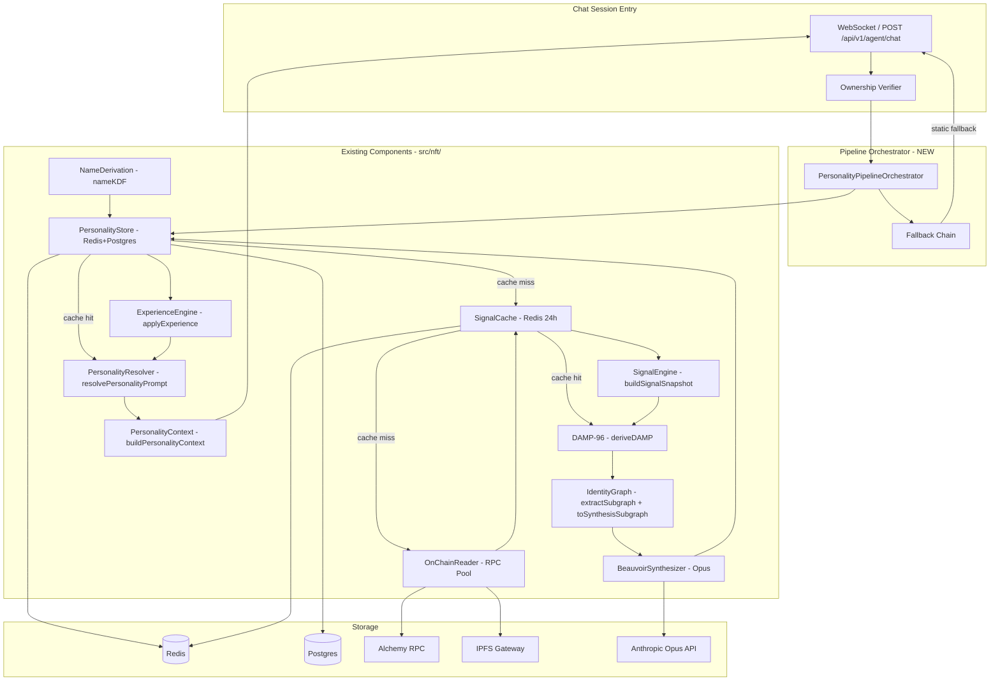

# SDD: Per-NFT Personality — Pipeline Wiring + Scale-Out Design

**Status:** Draft
**Author:** Jani + Claude
**Date:** 2026-03-26
**Cycle:** 040
**PRD:** `grimoires/loa/prd.md`
**References:** [Issue #132](https://github.com/0xHoneyJar/loa-finn/issues/132) · [Issue #133](https://github.com/0xHoneyJar/loa-finn/issues/133)

---

## 1. Project Architecture

### 1.1 System Overview

The system wires the existing 68-file NFT personality engine (~18K lines in `src/nft/`) into the live chat session flow. Today, `agent-chat.ts` resolves personality via `StaticPersonalityLoader` reading 4 generic entries from `config/personalities.json`. After this cycle, session creation triggers a pipeline: `tokenId → ownership verification → on-chain signal read → DAMP-96 derivation → identity graph enrichment → BEAUVOIR synthesis (Opus) → personality injection`. The experience engine also comes online for gradual dial drift over time.

The architecture is a **pipeline wiring** pattern within an existing monolithic Hono server, not a new service. All 68 files in `src/nft/` are already implemented; this cycle connects them into the session creation hot path and adds the orchestration layer.

### 1.2 Architectural Pattern

**Pattern:** Pipeline orchestrator within existing monolith (Hono server)

**Justification:** All pipeline components exist as isolated modules. The work is "last-mile" integration, not greenfield. A new service would add network hops and operational overhead for 5-10 users. The monolith already handles Redis, Postgres, RPC, and Anthropic API calls.

### 1.3 Component Diagram


```mermaid
graph TD
    subgraph "Chat Session Entry"
        WS[WebSocket / POST /api/v1/agent/chat]
        OV[Ownership Verifier]
    end

    subgraph "Pipeline Orchestrator - NEW"
        PO[PersonalityPipelineOrchestrator]
        FC[Fallback Chain]
    end

    subgraph "Existing Components - src/nft/"
        SC[SignalCache - Redis 24h]
        OCR[OnChainReader - RPC Pool]
        SE[SignalEngine - buildSignalSnapshot]
        DAMP[DAMP-96 - deriveDAMP]
        IG[IdentityGraph - extractSubgraph + toSynthesisSubgraph]
        BS[BeauvoirSynthesizer - Opus]
        ND[NameDerivation - nameKDF]
        PS[PersonalityStore - Redis+Postgres]
        EE[ExperienceEngine - applyExperience]
        PR[PersonalityResolver - resolvePersonalityPrompt]
        PC[PersonalityContext - buildPersonalityContext]
    end

    subgraph "Storage"
        Redis[(Redis)]
        PG[(Postgres)]
        RPC[Alchemy RPC]
        IPFS[IPFS Gateway]
        Anthropic[Anthropic Opus API]
    end

    WS --> OV
    OV --> PO
    PO --> PS
    PS -->|cache hit| PR
    PS -->|cache miss| SC
    SC -->|cache hit| DAMP
    SC -->|cache miss| OCR
    OCR --> RPC
    OCR --> IPFS
    OCR --> SC
    SC --> SE
    SE --> DAMP
    DAMP --> IG
    IG --> BS
    BS --> Anthropic
    BS --> PS
    ND --> PS
    PS --> EE
    EE --> PR
    PR --> PC
    PC --> WS
    PO --> FC
    FC -->|static fallback| WS

    PS --> Redis
    PS --> PG
    SC --> Redis
```

### 1.4 New Components

**PersonalityPipelineOrchestrator** (`src/nft/personality-pipeline.ts` — NEW)
- **Purpose:** Single orchestration point that sequences: cache check, signal resolution, DAMP derivation, identity graph enrichment, BEAUVOIR synthesis, cache write, experience application, and prompt resolution
- **Interface:** Implements `PersonalityProvider` — `get(tokenId: string): Promise<PersonalityConfig | null>`
- **Concurrency:** Per-token distributed lock via Redis `SET NX` with 30s expiry prevents duplicate synthesis. Concurrent requests wait on lock.
- **Dual-write:** Postgres first (idempotency key), then Redis. Read-repair on content hash mismatch.
- **BEAUVOIR sanitization:** Strip `<system-personality>` delimiters, system-role directives, and validate against section schema before storage.
- **Dependencies:** `SignalCache`, `OnChainReader`, `KnowledgeGraphLoader`, `BeauvoirSynthesizer`, `PersonalityStore`, `ExperienceEngine`, `NameDerivation`

**OwnershipGate** (centralized service function + middleware — NEW)
- **Purpose:** Centralized ownership verification that ALL session creation paths MUST use. Deny-by-default: if tokenId present but ownership not validated, reject.
- **Auth cache:** Separate 60s TTL owner cache (NOT the 24h signal cache). On NFT transfer, `transfer-listener.ts` invalidates immediately. Stores `blockNumber` for staleness detection.
- **Interface:** `verifyOwnership(tokenId, wallet): Promise<OwnershipResult>` — called by Hono middleware on every session route.
- **Dependencies:** `OnChainReader`, SIWE JWT, Redis (60s TTL owner cache)

**PreComputeScript** (`scripts/precompute-personalities.ts` — NEW)
- **Purpose:** CLI script that pre-computes personalities for a list of known tokenIds
- **Interface:** CLI accepting tokenIds, running full pipeline, validating anti-narration, reporting distinctiveness

### 1.5 Data Flow

```
1. User connects with tokenId + SIWE JWT
2. OwnershipGate: readOwner(tokenId) == JWT wallet?
   - No → 403 OWNERSHIP_REQUIRED
   - Yes → continue
3. PersonalityPipelineOrchestrator.get(tokenId):
   a. PersonalityStore.get(tokenId) [Redis → Postgres]
      - Hit → skip to step 3f
   b. SignalCache.getSignals(tokenId) [Redis → OnChainReader]
   c. deriveDAMP(snapshot) → DAMPFingerprint
   d. KnowledgeGraphLoader.extractSubgraph(...) → toSynthesisSubgraph(...)
   e. BeauvoirSynthesizer.synthesize(snapshot, fingerprint, subgraph)
      - validateAntiNarration() + retry loop (up to 3 attempts)
   f. PersonalityStore.write(tokenId, personality) [Redis + Postgres]
   g. ExperienceEngine.applyExperience(birthFingerprint, personalityId)
4. resolvePersonalityPrompt(personality) → <system-personality> delimiters
5. buildPersonalityContext(personalityId, archetype, fingerprint)
6. Compose system prompt, invoke model with personality context
7. Post-response: ExperienceAccumulator.record(metadata) [fire-and-forget]
```

### 1.6 External Integrations

| Service | Purpose | API Type |
|---------|---------|----------|
| Alchemy RPC | ERC-721 ownerOf + tokenURI calls | JSON-RPC via viem |
| IPFS Gateway | NFT metadata retrieval | HTTP GET |
| Anthropic Claude Opus | BEAUVOIR personality synthesis | REST via SynthesisRouter |
| Redis | Signal cache, personality cache, identity graph cache | ioredis |
| Postgres | Personality durable store, versioning | Drizzle ORM |

### 1.7 Deployment Architecture

No deployment changes. Pipeline wiring is entirely within the existing Hono server deployed on ECS (`arrakis-staging-cluster`, service `loa-finn-armitage`). Redis and Postgres are already provisioned.

### 1.8 Scalability Strategy (Document Only, Per PRD 5.5)

For 100K+ NFTs (not implemented this cycle, documented only):

1. **Batch Derivation:** Off-peak cron job iterates all minted tokenIds, runs `SignalCache.getSignals()` + `deriveDAMP()`, stores in Postgres. Uses `scripts/precompute-personalities.ts` as foundation.
2. **Cache Warming:** Proactive BEAUVOIR synthesis for top 1000 agents by interaction count. ExperienceStore provides the ranking.
3. **Synthesis Queue:** Rate-limited BullMQ job queue for BEAUVOIR generation to prevent Opus API bursts. Circuit breaker in `BeauvoirSynthesizer` already limits concurrent failures.
4. **Degradation Tiers:** Full personality → cached BEAUVOIR → generic archetype template → static fallback.
5. **Transfer Invalidation:** `transfer-listener.ts` already calls `invalidateOwnerCache()`. Wire into `PersonalityStore.invalidate(tokenId)` + `SignalCache.invalidate(tokenId)`.

### 1.9 Security Architecture

- **Authentication:** SIWE (Sign-In with Ethereum) + JWT chain (existing)
- **Authorization:** On-chain `ownerOf()` verification. Soft launch additionally requires `CHAT_ALLOWED_ADDRESSES` allowlist.
- **Prompt Injection Prevention:** Anti-narration validation (7 constraints), `<system-personality>` delimiters, content sanitization in `personality-resolver.ts`
- **Data Protection:** Personality stored in Redis (encrypted at rest via AWS, TTL 1h) and Postgres (encrypted at rest). RPC calls use HTTPS. No PII in personality data.

---

## 2. Software Stack

### 2.1 Backend Technologies (Existing, No Changes)

| Category | Technology | Version |
|----------|------------|---------|
| Runtime | Node.js | >= 22 |
| Language | TypeScript | 5.x |
| HTTP Framework | Hono | 4.x |
| Database ORM | Drizzle ORM | 0.45.x |
| Redis Client | ioredis | 5.x |
| Ethereum | viem | 2.x |
| Testing | vitest | 4.x |
| LLM SDK | Anthropic API | via SynthesisRouter |

**No new dependencies introduced.** All pipeline components exist; this cycle wires them together.

### 2.2 Infrastructure (Existing, No Changes)

| Category | Technology | Purpose |
|----------|------------|---------|
| Cloud | AWS (ECS Fargate) | Container orchestration |
| CI/CD | GitHub Actions | `deploy-staging.yml` |
| Caching | Redis (ElastiCache) | Signal cache, personality cache |
| Database | PostgreSQL (RDS) | Personality persistence |
| Object Storage | S3/R2 | BEAUVOIR.md versioned backup |

---

## 3. Database Design

### 3.1 Existing Schema (No New Tables Required for Core)

**`finn.finn_personalities`** (already exists in `src/drizzle/schema.ts`):
- `id` (text PK, ULID)
- `token_id` (text, unique index)
- `archetype` (text)
- `current_version_id` (text, FK)
- `created_at`, `updated_at` (timestamptz)

**`finn.finn_personality_versions`** (already exists):
- `id` (text PK, ULID)
- `personality_id` (text, FK)
- `version_number` (integer, monotonic)
- `beauvoir_template` (text)
- `damp_fingerprint` (jsonb — currently null, pipeline will populate)
- `epoch_number` (integer, default 0)
- `created_at` (timestamptz)

### 3.2 New Table: `finn_experience_snapshots`

```sql
CREATE TABLE finn.finn_experience_snapshots (
    personality_id TEXT PRIMARY KEY,
    topic_distribution JSONB NOT NULL DEFAULT '{}',
    style_counts JSONB NOT NULL DEFAULT '{}',
    metaphor_families JSONB NOT NULL DEFAULT '{}',
    interaction_count INTEGER NOT NULL DEFAULT 0,
    epoch_count INTEGER NOT NULL DEFAULT 0,
    dial_offsets JSONB NOT NULL DEFAULT '{}',
    pending_interactions JSONB NOT NULL DEFAULT '[]',
    created_at BIGINT NOT NULL,
    updated_at BIGINT NOT NULL
);
```

Needed for cross-deploy persistence of experience state. The existing `ExperienceStore` in-memory class loads from this on boot and flushes on epoch triggers.

### 3.3 Caching Strategy

| Layer | Store | Key Pattern | TTL | Purpose |
|-------|-------|-------------|-----|---------|
| Signal cache | Redis | `finn:signal:{tokenId}` | 24h | On-chain signal snapshots + owner |
| Personality store | Redis | `finn:personality:{tokenId}` | 1h | PersonalityConfig (BEAUVOIR + metadata) |
| Personality store | Postgres | `finn_personalities` + versions | Permanent | Durable persistence |
| Identity graph cache | Redis | `identity:graph:{version}:{archetype}:{ancestor}` | 24h | Codex subgraphs |
| Owner cache | In-memory | Map key `{collection}:{tokenId}` | 5min | Ownership verification |

### 3.4 Data Access Patterns

| Query | Frequency | Optimization |
|-------|-----------|--------------|
| PersonalityStore.get(tokenId) | Every chat session | Redis L1 (1h TTL), Postgres L2 |
| SignalCache.getSignals(tokenId) | Cache miss only | Redis (24h TTL), on-chain fallback |
| ExperienceEngine.applyExperience() | Every chat session | In-memory, loaded from Postgres at boot |
| IdentityGraphCache.get() | Cache miss only | Redis (24h TTL), codex artifact fallback |

---

## 4. API Specifications

### 4.1 Modified Endpoint: POST /api/v1/agent/chat

**Current behavior:** Resolves from `StaticPersonalityLoader` (4 static entries).
**New behavior:** Resolves from `PersonalityPipelineOrchestrator` via `PersonalityProviderChain`.

**Response (extended fields):**
```json
{
  "response": "...",
  "personality": {
    "archetype": "freetekno",
    "display_name": "TekSophos-4217",
    "agent_name": "TekSophos-4217",
    "era": "ancient",
    "routing_version": "4.5",
    "dominant_dimensions": ["cr_divergent_thinking", "ag_self_direction", "cg_systems_thinking"]
  }
}
```

**New error codes:**

| Code | Status | Condition |
|------|--------|-----------|
| `OWNERSHIP_REQUIRED` | 403 | SIWE wallet does not own tokenId |
| `ALLOWLIST_DENIED` | 403 | Wallet not in `CHAT_ALLOWED_ADDRESSES` |
| `PIPELINE_DEGRADED` | 200 | Personality resolved from fallback (logged, not error) |

---

## 5. Error Handling Strategy

### 5.1 Fallback & Degradation Chain

```
PersonalityStore (Redis → Postgres)
  → [cache miss] Full pipeline (on-chain → DAMP → graph → synthesis)
    → [on-chain fails] Reject (no cached signals)
    → [graph fails] Synthesize without cultural grounding (empty subgraph)
    → [synthesis fails] Use cached BEAUVOIR if available
      → [no cache] StaticPersonalityLoader (config/personalities.json)
```

Each degradation is logged with severity for monitoring.

---

## 6. Testing Strategy

| Level | Coverage | Scope |
|-------|----------|-------|
| Unit | 90% for new orchestrator | Pipeline orchestrator, ownership gate |
| Integration | Full pipeline flow | Cold cache → synthesis → cache write |
| Eval | Personality quality | Distinctiveness < 0.7, anti-narration 0% violations |

### Key Test Cases

1. Cache hit returns stored personality without RPC calls
2. Cache miss triggers full pipeline (mock OnChainReader, mock SynthesisRouter)
3. Identity graph failure degrades gracefully (empty subgraph)
4. BEAUVOIR synthesis failure falls back to cached version, then static
5. Ownership gate: matching wallet passes, non-owner gets 403
6. Experience drift clamped within bounds
7. Pre-compute script: 5 personalities pass validation, pairwise similarity < 0.7

---

## 7. Development Phases

### Sprint 1: Core Pipeline Wiring (P0)

| Task | Description | Files |
|------|-------------|-------|
| T1.1 | Create `PersonalityPipelineOrchestrator` | `src/nft/personality-pipeline.ts` (NEW) |
| T1.2 | Wire into `PersonalityProviderChain` | `personality-provider-chain.ts`, `server.ts` |
| T1.3 | Ownership verification gate | `agent-chat.ts` (middleware) |
| T1.4 | Fallback/degradation chain | Pipeline orchestrator error handling |
| T1.5 | Unit + integration tests | `tests/finn/personality-pipeline.test.ts` |
| T1.6 | Ownership gate tests | `tests/finn/ownership-gate.test.ts` |

**AC**: A tokenId in the WebSocket query produces a personality derived from on-chain traits, not static config.

### Sprint 2: Identity Graph + Experience Engine (P1)

| Task | Description | Files |
|------|-------------|-------|
| T2.1 | Wire identity graph into pipeline | `personality-pipeline.ts` |
| T2.2 | Wire experience engine into resolution | `personality-pipeline.ts` |
| T2.3 | Create `finn_experience_snapshots` table | `src/drizzle/schema.ts`, migration |
| T2.4 | Extend agent-chat response with metadata | `agent-chat.ts` |
| T2.5 | Identity graph integration tests | `tests/finn/identity-graph-integration.test.ts` |
| T2.6 | Experience engine wiring tests | `tests/finn/experience-wiring.test.ts` |

**AC**: Generated BEAUVOIR docs include cultural context. Personality dials shift after N interactions.

### Sprint 3: Pre-Compute + Polish (P1-P2)

| Task | Description | Files |
|------|-------------|-------|
| T3.1 | Create pre-compute script | `scripts/precompute-personalities.ts` (NEW) |
| T3.2 | Pre-compute 5 demo personalities | Script execution + validation |
| T3.3 | Wire transfer listener to cache invalidation | `transfer-listener.ts` |
| T3.4 | Scale-out architecture documentation | `docs/scale-out-design.md` (NEW) |
| T3.5 | End-to-end integration test | `tests/finn/personality-e2e.test.ts` |

**AC**: 5 personalities pre-computed, all pass validation, pairwise cosine < 0.7.

---

## 8. Known Risks

| Risk | Probability | Impact | Mitigation |
|------|-------------|--------|------------|
| Opus synthesis latency (10s+) | Medium | High | Pre-compute + loading state |
| On-chain RPC failures | Medium | Medium | Circuit breaker + fallback chain |
| Anti-narration false positives | Low | Medium | Retry loop with feedback |
| Identity graph missing data | Low | Low | Empty subgraph graceful fallback |
| Experience drift accumulation | Low | Medium | +/-5% cumulative clamp |

---

## 9. Open Questions

| Question | Owner | Status |
|----------|-------|--------|
| Which 5 team-owned tokenIds for soft launch? | @janitooor | Open |
| `collectionSalt` for `nameKDF()` in production? | @janitooor | Open |
| Experience flush: every epoch or batched? | Engineering | Open (recommend: every epoch) |

---

## 10. Key File Locations

| Component | Path | Lines | Change |
|-----------|------|-------|--------|
| Pipeline orchestrator | `src/nft/personality-pipeline.ts` | ~200 est. | NEW |
| Agent chat route | `src/gateway/routes/agent-chat.ts` | 149 | Modify |
| Provider chain | `src/nft/personality-provider-chain.ts` | 62 | Modify |
| Server composition | `src/gateway/server.ts` | 500+ | Modify |
| Drizzle schema | `src/drizzle/schema.ts` | 100+ | Add table |
| Transfer listener | `src/nft/transfer-listener.ts` | 231 | Wire invalidation |
| Identity graph | `src/nft/identity-graph.ts` | 483 | No changes |
| Experience engine | `src/nft/experience-engine.ts` | 322 | No changes |
| BEAUVOIR synthesizer | `src/nft/beauvoir-synthesizer.ts` | 511 | No changes |
| Personality store | `src/nft/personality-store.ts` | 228 | No changes |
| Signal cache | `src/nft/signal-cache.ts` | 123 | No changes |
| Name derivation | `src/nft/name-derivation.ts` | 229 | No changes |
| Pre-compute script | `scripts/precompute-personalities.ts` | ~150 est. | NEW |
